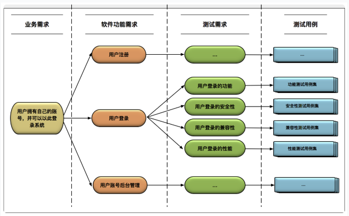

# 导言

## 前端测试工作

测试对前端工程师来说是质量保证的基础，不是只是写写程式，也并推给测试人员，更多的开发思维的进化（其实国外工程师视质量的保证是基本能力）。

开发中植入测试思维引出来关注点可能有：

1. 编程语言是什么？
2. 什么样的编成方式更适合写测试，函数式编程?物件导向编程？
3. 自动化测试？将测试带入集成。
4. 写的测试代码怎样才算是一条用例？使用者故事表示还是 SEB?
5. 如何写断言？下断言的设计。
6. 如何批量执行测试？测试数据跟测试程式分离？测试用例库？
7. 如何生成（HTML）测试报告？怎样得表现最容易检视代码风险？
8. 单元测试框架? Selenium\appium 手机跟 web 有什么不同。

感觉是个大坑，也是个大领域。

## 前端工作流
前端测试工作可分两块`TDD(单元测试)`与 `BDD 测试(验收测试)`。

让我们从前端工作流说起：

＝＝＝＝ PM 将业务需求完美疏理后之分隔线 ＝＝＝＝

1. 根据已确定的业务需求产出使用者故事
2. 完成验收测试定义 BDD（验收测试）
3. 将业务需求拆解成功能需求- 理出功能模块
4. 功能需求拆成测试需求及测试用例
5. 进入开发

    a. 先做好 HTML 架构  
    b. 套上 CSS 布局及样式  
    c. HTML 架构串接好数据  
    d. 开始写单元测试，完成測試覆蓋率 => **`单元测试`**  
    e. 开始编写功能代码  
    f. 重构，重复 d->e->f，直到完成功能  

6. 编写 BDD 测试，跑自动化，达到验收测试标准 => **`BDD 测试`**
7. 基准测试，测试代码的执行性能。 => **`性能测试`**

从工作流里可以看到，**`TDD(单元测试)`**、**`BDD 测试(验收测试)`** 及 **`性能测试`** 三块范围。也是我们要讲述的重点。

