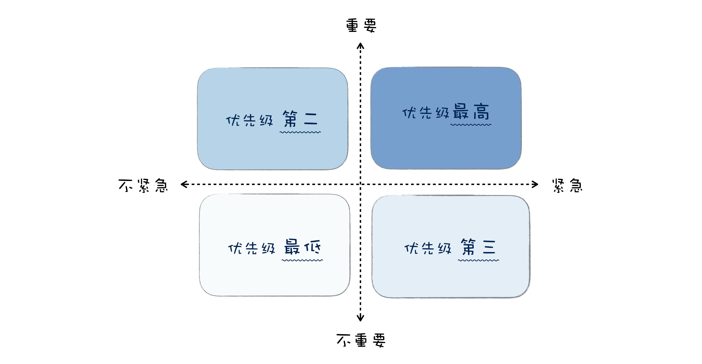
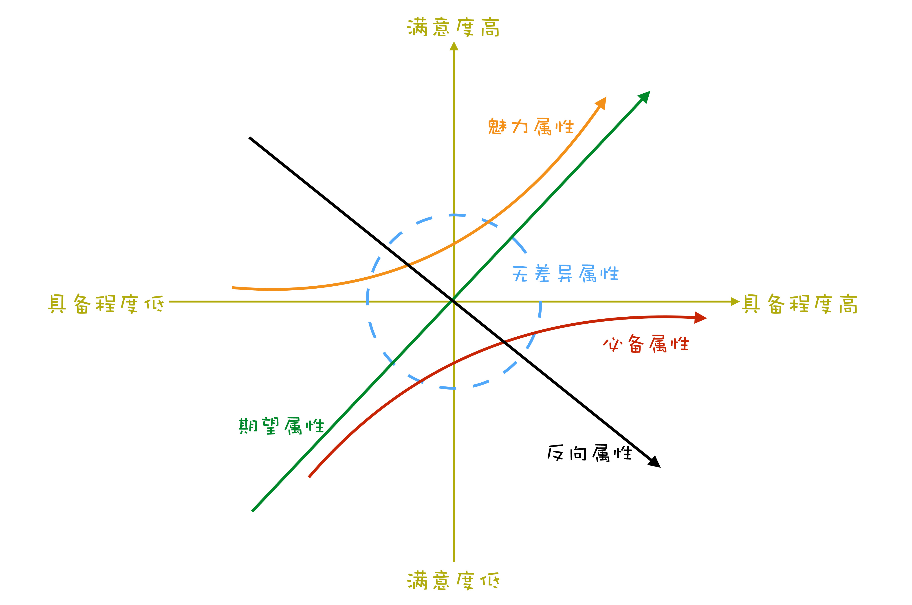
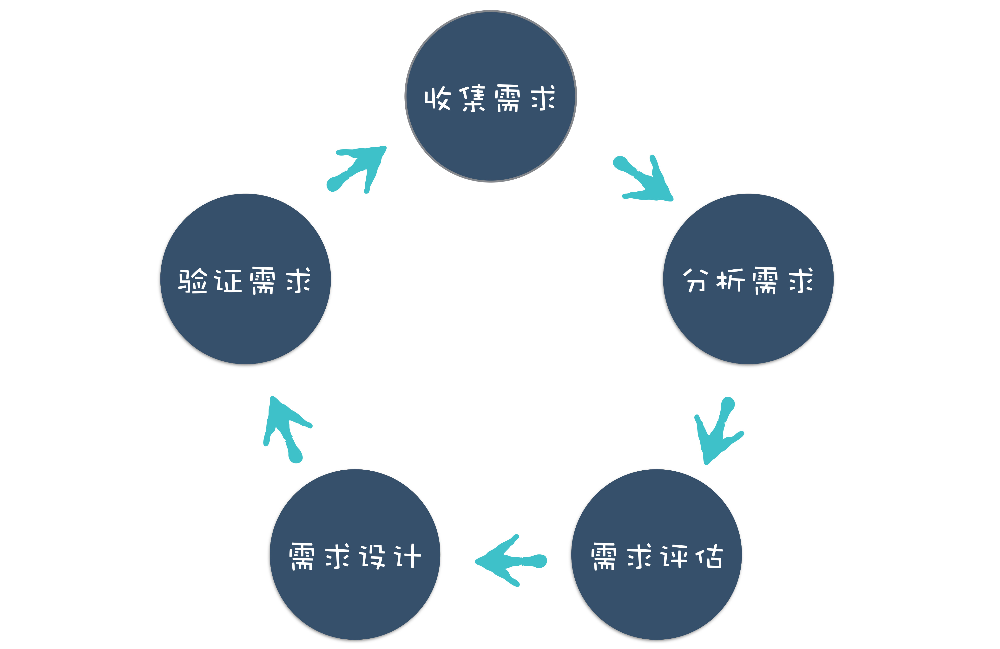

# 需求分析

没有确认需求，绝不轻易进入开发。

## 用户需求提炼成产品需求

需求分析，就是对用户需求进行提炼分析，最终形成产品需求的过程。
大部分用户提的需求，都不见得是其真实的需求，需要透过现象看本质，去挖掘其背后真实的需求。

### 提炼需求方法

#### ✓ Step1 挖掘收集需求

客户主动提供的需求不一定完整及充足，需要继续收集用户需求
收集用户需求方法有：

-   头脑风暴：就是大家一起开会头脑风暴讨论；
-   用户调研：通过调查问卷或者访谈，通过问用户一些问题收集反馈；
-   竞品分析：通过分析其他同类产品的功能获得需求；
-   快速原型：通过原型来收集反馈，收集确认需求。

#### ✓ Step2 分析出真实需求

收集了需求，就要分析用户的真实需求，这是最难的部分

真实需求从下面三点下手

-   目标用户：用户不同，诉求也不一样；
-   使用场景：使用场景不一样，解决方案也会有所不同；
-   想要解决的问题：用户背后想要解决的问题是什么。

有了目标用户跟使用场景，理出背后真实想要解决的问题

-   表层需求(直接传达的诉求)：用户对解决问题的期望，例如马车更快；
-   深层需求(诉求原因)：用户的深层次动机，诉求产生的原因，例如乘客对出行速度的要求；
-   底层需求(最终是要？)：人性本能的需求，例如对安全感对舒适的追求。

举例

> 要解决字幕的问题
> 表层需求：显示字幕；
> 深层需求：语言不好，跟不上老师节奏；
> 底层需求：聋哑学生无法听到声音，只能通过字幕学习。

> 要解决快进的问题
> 表层需求：能快进播放；
> 深层需求：可以节约学习的时间，提高效率；
> 底层需求：取得好的学习成绩

#### ✓ Step3 评估需求

-   可行性：技术能否实现；
-   成本：人力成本、时间成本；
-   商业风险和收益：有没有商业上的风险，收益是否合理；
-   紧急性与重要性：是不是用户迫切的需求。

▾ 紧急重要四象限

▾ KANO

KANO 说明

-   红色曲线，是用户认为必须要有的功能；
-   绿色曲线，就是用户明确提出的需求；
-   黄色曲线，属于兴奋型需求，就是用户自己没想到，超出预期的功能。

#### ✓ Step4 提出解决方案

结合产品定位，提出相应的解决方案。建立 prototype
最终的产品设计，会落实到人机交互上面，用户可以通过软件界面交互。

#### ✓ Step5 筛选和验证方案

过滤方案并跟客户确认，确保方案能解决用户需求。在收集反馈后，进行修改和调整，最终确认了产品的设计。

#### ✓ Step6 成为产品需求

依照需求优先级进入开发机段
