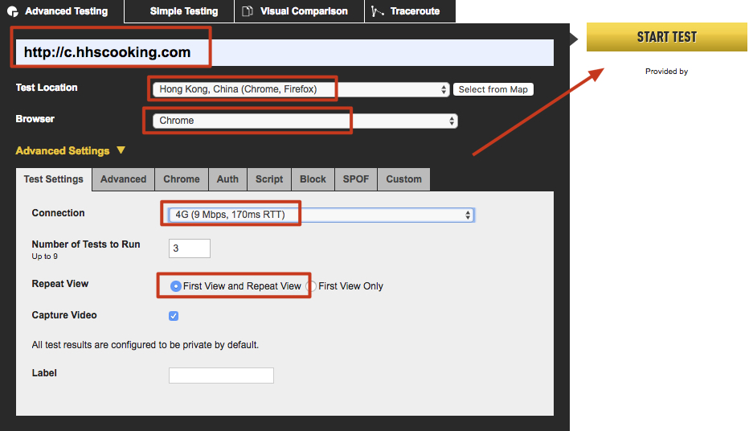
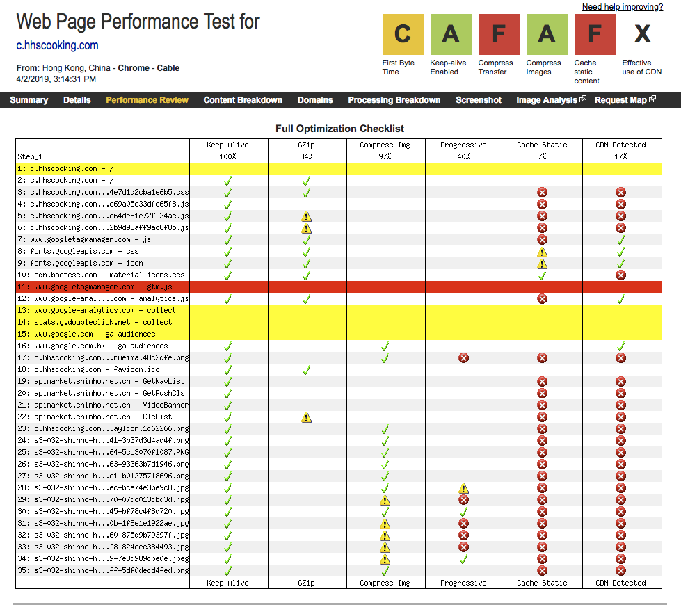
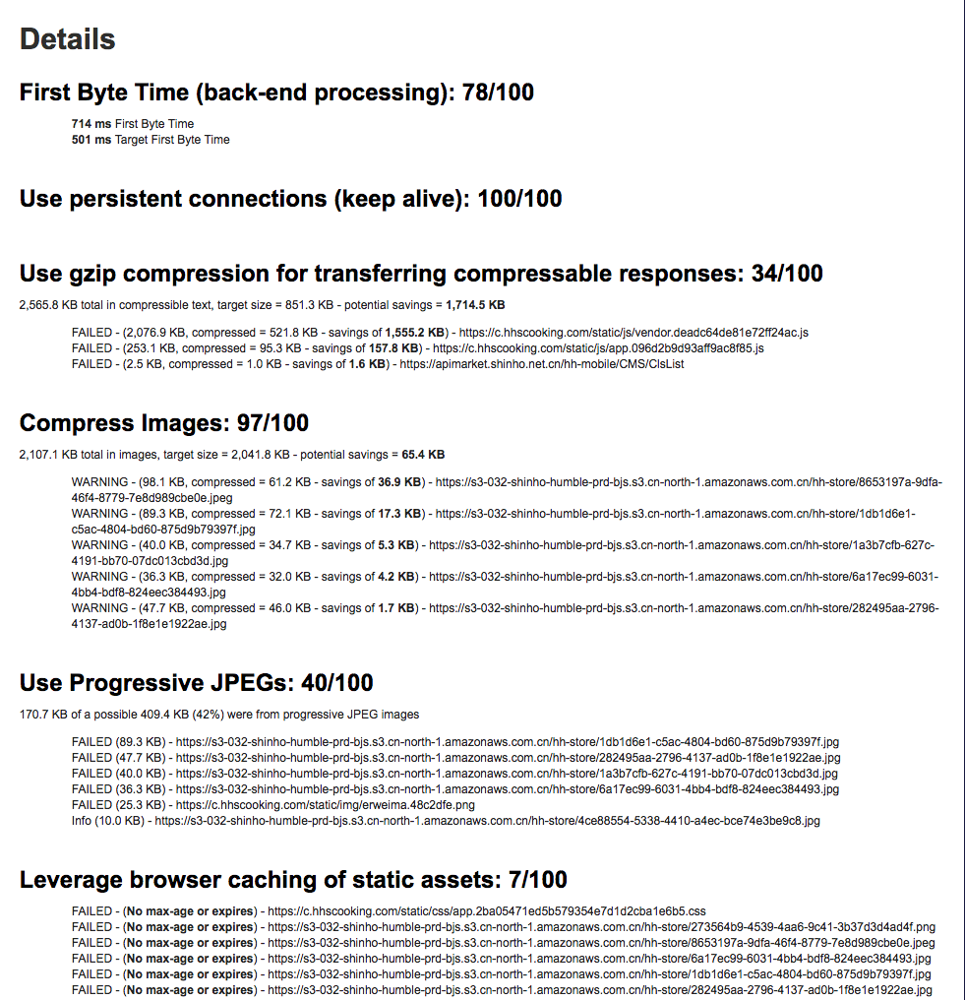
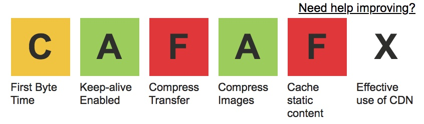
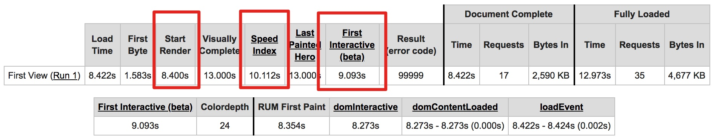

# 性能测试

以软件系统为例，不同角色关注的性能重点不同

### 终端用户关注的性能

-   系统响应时间，反应的是系统能力，又可以进一步细分为应用系统处理时间、数据库处理时间和网络传输时间等；
-   前端展现时间，取决于用户端的处理能力。

### 系统运维人员关注的性能

大量用户并发访问时的负载，以及可能的更大负载情况下的系统健康状态、并发处理能力、当前部署的系统容量、可能的系统瓶颈、系统配置层面的调优、数据库的调优，以及长时间运行稳定性和可扩展性。

### 软件设计开发人员关注的性能

1.算法设计包含的点：

-   核心算法的设计与实现是否高效
-   必要时，设计上是否采用 buffer 机制以提高性能，降低 I/O
-   是否存在潜在的内存泄露
-   是否存在并发环境下的线程安全问题
-   是否存在不合理的线程同步方式
-   是否存在不合理的资源竞争

    2.架构设计包含的内容：

-   站在整体系统的角度，是否可以方便地进行系统容量和性能扩展
-   应用集群的可扩展性是否经过测试和验证
-   缓存集群的可扩展性是否经过测试和验证
-   数据库的可扩展性是否经过测试和验证

    3.性能最佳实践包含的点：

-   代码实现是否遵守开发语言的性能最佳实践
-   关键代码是否在白盒级别进行性能测试
-   是否考虑前端性能的优化
-   必要的时候是否采用数据压缩传输
-   对于既要压缩又要加密的场景，是否采用先压缩后加密的顺序

    4.数据库相关的点：

-   数据库表设计是否高效
-   是否引入必要的索引
-   SQL 语句的执行计划是否合理
-   SQL 语句除了功能是否要考虑性能要求
-   数据库是否需要引入读写分离机制
-   系统冷启动后，缓存大量不命中的时候，数据库承载的压力是否超负荷

    5.软件性能的可测试性包含的点：

-   是否为性能分析（Profiler）提供必要的接口支持
-   是否支持高并发场景下的性能打点
-   是否支持全链路的性能分析

### 性能测试人员眼中的软件性能

全盘考量，关注算法设计、架构设计、性能最佳实践、数据库相关、软件性能的可测试性这五大方面，各个击破。

## 衡量性能的常用指标：并发用户数、响应时间，以及系统吞吐量

### ✓ 并发用户数

一间公司 5000 名员工拥有帐号，假设在某一时间点上，这 2500 个用户中，30% 用户处于页面浏览状态（对服务器没有发起请求），20% 用户在填写订单（也没有对服务器发起请求），5% 用户在递交订单，15% 用户在查询订单，而另外的 30% 用户没有进行任何操作。那么此时，这 2500 个“并发用户”中真正对服务器产生压力的只有 500 个用户（（5%+15%）\*2500=500）。

分析得到准确的用户行为模式，是性能测试中的关键一环。

#### 获取用户行为模式的方法

-   已经上线的系统 - 采用系统日志分析法获取用户行为统计和峰值并发量等
-   未上线的全新系统 - 参考行业中类似系统的统计信息来建模，然后分析

### ✓ 响应时间

应用系统从请求发出开始，到客户端接收到最后一个字节数据所消耗的时间

对于软件服务器端的性能测试肯定要采用标准定义，而对于前端性能评估，则应该采用用户主观感受时间的定义。

前端 - 呈现时间，取决于客户端收到服务器返回的数据后渲染页面所消耗的时间。可采用提前渲染技术，使得用户实际感受到的响应时间通常要小于标准定义的响应时间。
后端 - 系统响应时间，又可以进一步划分为 Web 服务器时间、应用服务器时间、数据库时间，以及各服务器间通信的网络时间。

响应时间，分为前端展现时间和系统响应时间两部分。其中，前端时间，又称呈现时间，取决于客户端收到服务器返回的数据后渲染页面所消耗的时间；而系统响应时间，又可以进一步划分为 Web 服务器时间、应用服务器时间、数据库时间，以及各服务器间通信的网络时间。

### ✓ 系统吞吐量

所有对吞吐量的讨论都必须以“单位时间”作为基本前提

Requests/Second、Pages/Second、Bytes/Second 皆表示吞吐量。

盲点：
比如，某个测试场景中采用 100 个并发用户，每个用户每隔 1 秒发出一个 Request，另外一个测试场景采用 1000 个并发用户，每个用户每隔 10 秒发出一个 Request。显然这两个场景具有相同的吞吐量, 都是 100 Requests/second，但是两种场景下的系统性能拐点肯定不同。因为，两个场景所占用的资源是不同的。

## 常用的七种性能测试方法

1.后端性能测试（Back-end Performance Test）
除了包括并发用户数、响应时间和系统吞吐量外，还应该包括各类资源的使用率，比如 CPU 占用率、内存使用率、磁盘 I/O 和网络 I/O 等 2.前端性能测试（Front-end Performance Test）
[雅虎（Yahoo）前端团队总结的 7 大类 35 条前端优化](https://developer.yahoo.com/performance/rules.html?guccounter=1) 3.代码级性能测试（Code-level Performance Test）
单元测试阶段就对代码的时间性能和空间性能进行必要的测试和评估 4.压力测试（Load/Stress Test）
并试图找到系统处于临界状态时的主要瓶颈点。 5.配置测试（Configuration Test）
先通过性能基准测试（Performance Benchmark）建立性能基线（Performance Baseline），再加入不同配置条件，找到特定压力下的配置 6.并发测试（Concurrence Test） 7.可靠性测试（Reliability Test）
真实环境下会有高峰和低谷的交替变化，模拟出真实的负载情况，我们会每 12 小时模拟一个高峰负载，两个高峰负载中间会模拟一个低峰负载，依次循环 3-7 天，形成一个类似于“波浪形”的系统测试负载曲线。

|                | 能力验证 | 能力规划 | 性能调优 | 缺陷发现 |
| -------------- | -------- | -------- | -------- | -------- |
| 后端性能测试   | v        | v        | v        | v        |
| 前端性能测试   |          |          | v        |          |
| 代码级性能测试 |          |          | v        | v        |
| 压力测试       | v        | v        | v        | v        |
| 配置测试       |          | v        | v        |          |
| 并发测试       |          |          | v        | v        |
| 可靠性测试     | v        | v        | v        |          |

## Tool: [WebPagetest](https://www.webpagetest.org/)

特点

-   量化页面的加载时间、首字节时间、渲染开始时间、最早页面可交互时间、页面中各种资源的字节数、后端请求数量等一系列数据；
-   给出页面性能评价指标，提出改进点
-   提供 Filmstrip 视图、Waterfall 视图、Connection 视图、Request 详情视图和页面加载视频慢动作。

使用方法

1. 预检视页面
2. 选择发起地点与浏览器
3. 环境网路速度
4. 选择 First View and Repeat View

以[寒舍欣和](https://www.webpagetest.org/result/190402_25_83f456b0ed8c947cdbcb989d9d9bf7a9/1/performance_optimization/) 来说，结果如下

先看到右上角

1. First Byte Time - 指的是用户发起页面请求到接收到服务器返回的第一个字节所花费的时间。
2. Keep-alive Enabled - 针对页面上用到的 Web 资源（图片、JavaScript、CSS），尽可能重用已经建立好的链接，而避免每次使用都去创建新的链接。
3. Compress Transfer - 如果将页面上的各种文本类的资源，比如 Html、JavaScript、CSS 等，可进行压缩传输部分
4. Compress Images - 图像文件进行压缩处理。也推荐 JPEG 格式图片使用渐进式 JPEG（Progressive JPEG）技术
5. Cache Static Content - 一般情况下，页面上的静态资源不会经常变化，可以缓存这些资源，并减少 Web 服务器的负载。
6. Effective use of CDN - 采用 CDN 缓存服务器。

其他指标

1. Start Render - 浏览器开始渲染的时间
2. First Interactive - 最早的页面可交互时间。
3. Speed Index - 衡量体验的数值，通常来讲，它的值越小越好。
