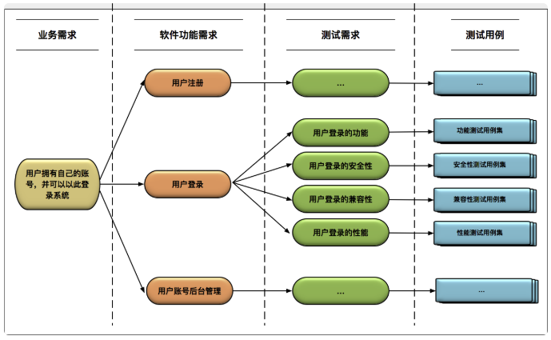

# 任务拆解

确认产品需求（业务需求）后，便可进行下图流程
从业务那接到需求，到验收测试，有下图流程

1. 将需求以使用者故事方式进行疏理，同时定义验收测试
2. 根据使用者故事，推演需求是否完整，未完整的需要补完
比如:身为一个用户，通过输入用户名宇密码进行登入
遗漏:用户需要先进行注册
3. 进行拆解成任务。按照一个需求、一个需求的过程走，这样，任务是可以随时停下来的。（不要一个类一个类写）
4. 以任务清单来进行工作，这些任务的依赖关系以及“完整地实现一个需求”的原则。
