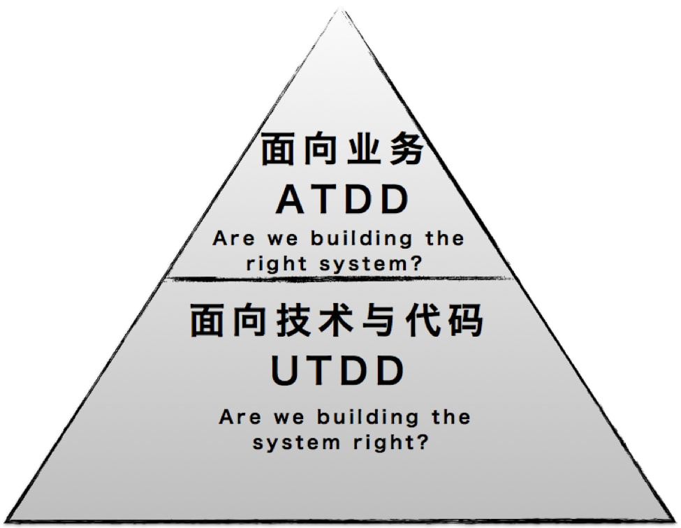
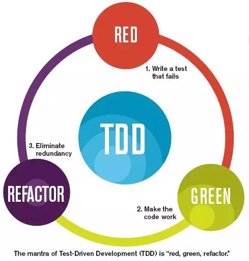
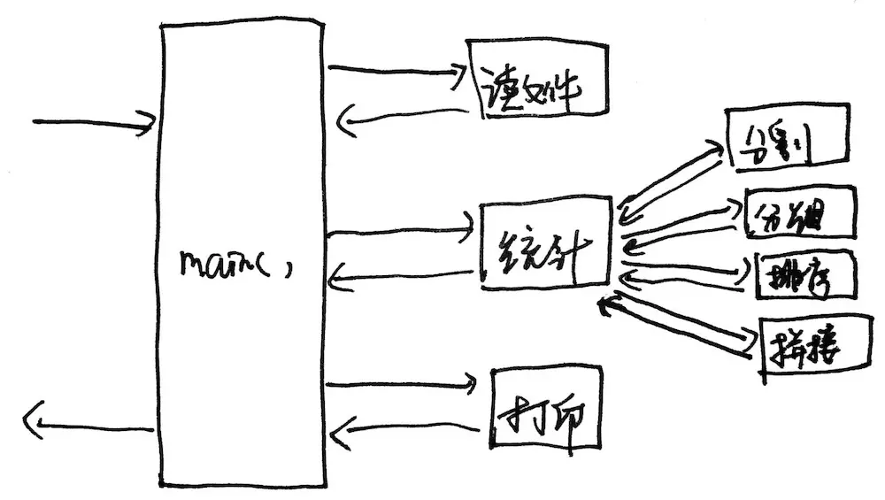

# TDD
> **不属于测试，而是属于软件开发**。

## 一直被误解的 TDD

先来说说单元测试典型的理解。基于代码的某个单元，使用 Mock 等技术编写`单元测试`，然后用这个单元测试来驱动开发，抑或是帮助在`重构、修改以后进行回归测试`。而现在大部分反对 TDD 的声音就是基于这个理解，如
- 工期紧，时间短，写 TDD 太浪费时间；
- 业务需求变化太快，修改功能都来不及，根本没有时间来写 TDD；
- 写 TDD 对开发人员的素质要求非常高，普通的开发人员不会写；
- TDD 推行的最大问题在于大多数程序员还不会「写测试用例」和「重构」；
- 由于大量使用 Mock 和 Stub 技术，导致 UT 没有办法测试集成后的功能，对于测试业务价值作用不大
- ……

## 正确理解 TDD 概念

TDD 有广义和狭义之分，常说的是狭义的 TDD，也就是 `UTDD（Unit Test Driven Development`）。广义的 TDD 是 `ATDD（Acceptance Test Driven Development）`包括 **BDD（Behavior Driven Development）**、**EDD（Example Driven Development）**，**FDD（Feature Driven Development）**、**CDCD（Consumer Driven Contract Development）** 等各种的实践方法。。

- UTDD 的原理是在`开发功能代码之前，先编写单元测试用例代码`，测试代码确定需要编写什么产品代码。

> ATDD： **Acceptance Test Driven Development（验收测试驱动开发）**
这是一种在编码开始之前将客户带入`测试设计过程`的技术。它也是一个协作实践，`用户，测试人员和开发人员`定义了自动验收标准。 ATDD 有助于确保所有项目成员准确理解需要完成和实施的内容。如果系统未通过测试可提供快速反馈，说明未满足要求。`验收测试以业务领域术语进行指定`。每个功能都必须提供真实且可衡量的业务价值，事实上，如果您的功能没有追溯至至少一个业务目标，那么您应该想知道为什么您要首先实施它。

- BDD：行为验收标准
- EDD：特定的实例数据为验收标准
- FDD: 它强调**特性驱动**，快速迭代，即能保证快速开发，又能保证适当文档和质量，非常适合中小型团队开发管理。它提出的每个功能开发时间不超过两周，为每个用例 user case 限定了粒度，具有良好可执行性，也可以对项目的开发进程进行精确及时地监控。它抓住了软件开发的核心问题领域，即**正确和及时地构造软件*。
- CDCD：以 Web Service API 消费者提出 API 契约来驱动 API 提供者开发 API

我们可以根据我们的业务场景，决定 TDD 是广义 (ATDD) 还是狭义 (UTDD) 的应用。如 Facebook 在金钱和人力资源相对充足、时间相对充裕的情况下追求的是代码质量，大量人员的良好协作与平台稳定，单元测试（UTDD）是非常有价值的。DHH 却在金钱和人力资源相对较少情况下追求最大化客户业务价值，使得少量人员能快速开发出软件并卖给客户赚钱，功能测试或者 ATDD 却更为适合。

## 传统编码 & TDD 编码
### 传统编码方式
- 需求分析，想不清楚细节，管他呢，先开始写
- 发现需求细节不明确，去跟业务人员确认
- 确认好几次终于写完所有逻辑
- 运行起来测试一下，靠，果然不工作，调试
- 调试好久终于工作了
- 转测试，QA 测出 bug，debug， 打补丁
- 终于，代码可以工作了
- 一看代码烂的像坨屎，不敢动，动了还得手工测试，还得让 QA 测试，还得加班...

### TDD 编码方式
- 先分解任务，分离关注点
- 列 Example，用实例化需求，澄清需求细节
- 写测试，只关注需求，程序的输入输出，不关心中间过程
- 写实现，不考虑别的需求，用最简单的方式满足当前这个小需求即可
- 重构，用手法消除[代码里的坏味道](../refactor/)
- 写完，手动测试一下，基本没什么问题，有问题补个用例，修复
- 转测试，小问题，补用例，修复
- 代码整洁且用例齐全，信心满满地提交

## TDD 思维
以下提及的 TDD ，我们探讨狭义的 UTDD 。
### TDD 的好处 
- 明确的流程，一次只关注一个点，开发思维负担小
- 对于需求变更起到保护网的作用
- 先写测试可以帮助我们去思考需求，并提前澄清需求细节
- 取代手工测试，让问题反馈更快速

### TDD 流程
TDD 是一种流程（而非设计工具）

1. 写一个测试用例
2. 运行测试（状态：红色不通过）
3. 写刚好能让测试通过的实现
4. 运行测试（状态：绿色通过）
5. 识别坏味道，用手法修改代码（进行重构）
6. 运行测试（状态：绿色通过）

本质是：
- 分离关注点，一次只戴一顶帽子，也就是`重构`跟`添加新功能`，一次仅做一种行为。
- 在我们编程的过程中，有几个关注点：需求，实现，设计。
- TDD 给了我们明确的三个步骤，每个步骤关注一个方面。
	➊ **红**：写一个失败的测试，它是对一个小需求的描述，只需要`关心输入输出`，这个时候根本`不用关心如何实现`。
	➋ **绿**：专注在`用最快的方式实现当前这个小需求`，不用关心其他需求，也不要管代码的质量多么惨不忍睹。
	➌ **重构**：既不用思考需求，也没有实现的压力，只需要找出代码中的坏味道，并用一个手法消除它，`让代码变成整洁的代码`。

### TDD 的三条规则
1. 在一个单元测试中，只允许编写刚好能够`导致失败的内容`（编译错误也算失败）
2. 除非是为了使一个失败的 unit test 通过，否则`不允许编写任何产品代码` 
3. 只允许编写`刚好`能够使一个失败的 unit test 通过的产品代码

## 为什么很多人做 TDD 都做不起来？
- 不会合理`拆分任务`
TDD 之前要拆分任务，把一个大需求拆成多个小需求。也可以拆出多个函数来。

- 不会写测试
什么是有效的单元测试，有很多人写测试，连到底在测什么都不清楚，也可能连断言都没有，通过控制台输出，肉眼对比来验证。
::: tip 好的单元测试应该符合几条原则
- 简单，只测试一个需求
- 符合 Given-When-Then 格式
- 速度快
- 包含断言
- 可以重复执行
:::

- 不会写刚好的实现
很多人写实现的时候无法专注当前需求，一不小心就把其他需求也实现了，就破坏了节奏感

- 不会重构
不懂什么是 Clean Code，看不出 Smell，没有及时重构，等想要重构时已经难以下手了。
不知道用合适的「手法」消除 Smell。

- 基础设施
对于特定技术栈，没有把单元测试基础设施搭建好，导致写测试时无法专注在测试用例上。

[单元测试演示](https://www.bilibili.com/video/av9208705/)

<!-- ## TDD 工作步骤
1. 接到一个功能需求，可以找其他人讨论进行提前设计（脑子里想或是纸上都可以）

2. 一边写一边补用例
3. 重构的时候进行代码抽象和拆分 -->

## 参考
- [直播](https://www.bilibili.com/video/av9208705/)
- [简单设计四规则](https://martinfowler.com/bliki/BeckDesignRules.html)
- [SOLID](https://zh.wikipedia.org/wiki/SOLID_(%E9%9D%A2%E5%90%91%E5%AF%B9%E8%B1%A1%E8%AE%BE%E8%AE%A1))

::: tip TDD 练功尝试
1. 写 TDD 时，一个测试如果不能 5 分钟完成. 就算太大了 
2. 尝试不用滑鼠，仅用快捷键编码
:::
