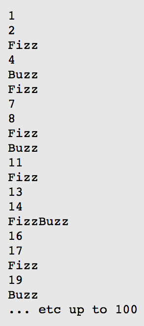

## TDD 体验
此体验活动来自[熊节大大的 TDD 课程](http://plus.jikexueyuan.com/tdd)

## 项目介绍
这是一个简单的猜数字游戏。

想象你是个小学5年级的学生，现在还有5分钟就要下课，数学老师带全班同学玩一个小游戏。他会用手指挨个指向每个学生，被指着的学生就要依次报数：第一个被指着的学生说“1”，第二个被指着的学生说“2”，以此类推。

呃……并不完全“以此类推”……如果一个学生被指着的时候，应该报的数是3的倍数，那么他就不能说这个数，而是要说“Fizz”。同样的道理，5的倍数也不能被说出来，而是要说“Buzz”。

于是游戏开始了，老师的手指向一个个同学，他们开心地喊着：“1！”，“2！”，“Fizz！”，“4！”，“Buzz！”……终于，老师指向了你，时间仿佛静止，你的嘴发干，你的掌心在出汗，你仔细计算，然后终于喊出“Fizz！”。运气不错，你躲过了一劫，游戏继续进行。

为了避免在自己这儿失败，我们想了一个作弊的法子：最好能提前把整个列表打印出来，这样就知道到我这儿的时候该说什么了。全班有33个同学，游戏可能会玩2到3轮。现在，赶紧去写代码吧！

任务：写一个程序，打印出从1到100的数字，将其中3的倍数替换成“Fizz”，5的倍数替换成“Buzz”。既能被3整除、又能被5整除的数则替换成“FizzBuzz”。

示例输出：


### 第二阶段：需求变更。

如果一个数能被3整除，或者包含数字3，那么这个数就是“Fizz”
如果一个数能被5整除，或者包含数字5，那么这个数就是“Buzz”

## 教学目标

- 掌握测试驱动开发基本节奏
- 至少练习 3 遍 FizzBuzz 题目
- 能在 10 分钟内完成 FizzBuzz 题目

## 参考

```js
// FizzBuzz.test.js

import FizzBuzz from './FizzBuzz'

describe('This is FizzBuzz game',()=>{
  let fizzBuzz=new FizzBuzz();
  describe('Day1,Task1',()=>{

    test('The fizzBuzz is defineded', () => {
      expect(fizzBuzz).toBeDefined();
    })

    test('If this input number is normal number', () =>{
      expect(fizzBuzz.checkDivisibleNumber(1)).toBe('1');
      expect(fizzBuzz.checkDivisibleNumber(2)).toBe('2');
    })

    test('If the number can be divisible by 3 , print Fizz',()=>{
      expect(fizzBuzz.checkDivisibleNumber(3)).toBe('Fizz');
    })

    test('If the number can be divisible by 5 , print Buzz',()=>{
      expect(fizzBuzz.checkDivisibleNumber(5)).toBe('Buzz');
    })

    test('If the number can be divisible by 3 and 5 , print FizzBuzz', ()=>{
      expect(fizzBuzz.checkDivisibleNumber(15)).toBe('FizzBuzz');
    })
  })
  
  describe('Day1,Task2',()=>{
    test('If this input number is normal number', () =>{
      expect(fizzBuzz.checkDivisibleAndContainNumber(76)).toBe('76');
    })
    test.each`
    num   | expected
    ${33} |  ${'Fizz'}
    ${31} |  ${'Fizz'}
    ${23} |  ${'Fizz'}
    `('If the nember can be divisible by 3 and the nember contain 3',({num,expected})=>{
      expect(fizzBuzz.checkDivisibleAndContainNumber(num)).toBe(expected);
    })

    test.each`
    num   | expected
    ${55} |  ${'Buzz'}
    ${25} |  ${'Buzz'}
    ${52} |  ${'Buzz'}
    `('If the nember can be divisible by 5 and the nember contain 5',({num, expected})=>{
      expect(fizzBuzz.checkDivisibleAndContainNumber(num)).toBe(expected);
    })

    test('If the number can be divisible by 3 and 5 ',()=>{
      expect(fizzBuzz.checkDivisibleAndContainNumber(15)).toBe('FizzBuzz');
    })

  })
})

```
```js
// FizzBuzz.js
/**
 * @description
 * 任务1-1：写一个程序，打印出从 1 到 100 的数字，将其中3的倍数替换成“Fizz”，5的倍数替换成“Buzz”。既能被3整除、又能被5整除的数则替换成“FizzBuzz”。
 * 任务1-2：如果一个数能被 3 整除，或者包含数字 3，那么这个数就是“Fizz”
 *          如果一个数能被 5 整除，或者包含数字 5，那么这个数就是“Buzz”
 * @export
 * @class FizzBuzz
 */
export default class FizzBuzz{
  constructor(){
  }
  checkDivisibleNumber(inputNum){
    let result='';
    if(this.isDivided(3,inputNum)){
      result+='Fizz';
    }
    if(this.isDivided(5,inputNum)){
      result+='Buzz';
    }
    if(result===''){
      result+=String(inputNum)
    }
    return result;
  }

  checkDivisibleAndContainNumber(inputNum){
    if(this.isDivided(3,inputNum) && this.isDivided(5,inputNum)){
      return 'FizzBuzz';
    }

    if(this.isDivided(3,inputNum) || this.isContain(3,String(inputNum))){
      return 'Fizz';
    }

    if(this.isDivided(5,inputNum) || this.isContain(5,String(inputNum))){
      return 'Buzz'
    }
    return String(inputNum);
  }

  isContain(num,inputNum){
    return RegExp(num).test(String(inputNum))
  }
  isDivided(num,inputNum){
    return inputNum % num ===0
  }

}

```
