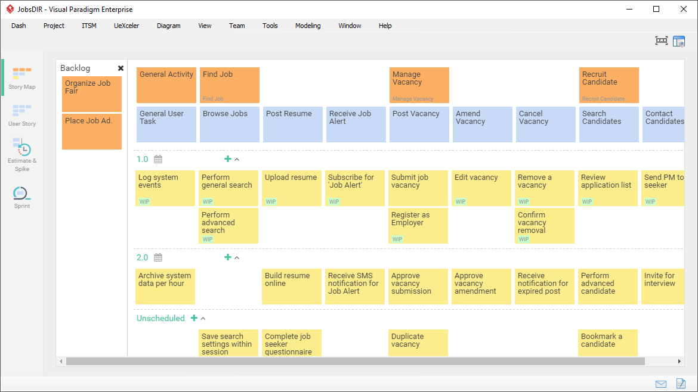

# 用户故事＆用户故事地图

## 你需要先知道

1. 用户故事不是另一种写需求的方式，讲述用户故事，在过程中用文字和图片相结合的方式辅助讨论，是一种建立共识的机制
2. 用户故事不是需求，是问题解决方案的讨论，让我们对开发的功能达到共识
3. 我们的工作不是开发更快且更多，而是使投入精力开发的成果和影响可以最大化

::: tip
我们在一起讨论用户故事，力求对要求解决的问题达成一至理解，并努力找到可以解决问题的最佳方案
:::

故事，是程序员和其他角色进行沟通得基本要素，故事地图以结构化方式来组织这些要素，借此来强化软件开发过程中最关键的环节--沟通。

请充分参加开发讨论，文档重要的不是记了什么，而是帮我们想起什么，

开发前为了需求明确一定会对业务进行疏理，采用使用者故事的疏理方式可以让我们后续的测试工作更省力。这里谈谈使用者故事。

## 用户故事包括三个基本要素：

- [角色]：谁要使用这个功能。
- [活动]：需要完成什么样的功能。
- [商业价值]：为什么需要这个功能以及这个功能带来什么样的价值。

三要素串接：
作为一个 `角色` ➔ 用户的类型， 
我想要 `活动` ➔ 先这样做，然后那样做，就应该得到...的结果， 
以便于 `商业价值`

举例：

1. 作为一个网站管理员，我想要统计每天有多少人访问了我的网站，以便于我的赞助商了解我的网站会给他们带来什么收益。
2. 作为购书者，我希望可以根据 ISBN 来找到一本书，以便能更快的找到正确的书。

## 用户故事的 INVEST 特性：

一个优秀且高质量的故事应该具备以下特点：

1. Independent：独立性。最好用户故事不要彼此依赖。
2. Negotiable：可协商。故事卡片是一种提醒，团队成员应该基于此对话，而不是把故事卡片看做确定性的需求。
3. Valuable：具有外部价值。避免仅仅对开发人员有价值的故事。
4. Estimable：可估计。用户故事规模适中，对应的业务知识和技术知识得到澄清，从而可以估计用户故事的规模。但是让开发者难以估计故事的问题来自：1.开发人员缺少领域知识；2.开发人员缺少技术知识；3.故事太大了。
5. Small：小。即将开发的用户故事应该足够小，从而能便于迭代、便于调整优先级，便于需求澄清，等等。至少要确保的是在一个迭代或 Sprint 中能够完成。
6. Testable：可测试。可测试的故事意味着需求是清晰、可验证的。如果一个用户故事不能够测试，那么你就无法知道它什么时候可以完成。一个不可测试的用户故事例子：用户必须觉得软件很好用。

## 用户故事的 3C 特性：

用户故事的描述信息以传统的手写方式写在纸质卡片上，所以 Ron Jeffries(2001)对
Card（卡片）, Conversation（对话）和 Confirmation（确认），这三个方面称为 3C。

-   **卡片（Card）**：用户故事一般在小卡片上写着故事的简短描述，工作量估算等。
-   **交谈（Conversation）**：用户故事背后的细节来源于和客户产品负责人、开发团队之间的交流沟通。
-   **确认（Confirmation）**：通过验收测试确认用户故事被正确完成。

#### 怎么知道用户故事何时完成？

使用“完成定义”技术。简而言之，Done 的定义是团队成员之间对工作完成意义的共同理解。

完成定义的示例：（可以将验收标准写下，置于显眼地方）

-   单元测试通过
-   代码经过 Peer review
-   用户验收测试通过
-   集成测试通过
-   回归测试通过
-   用户指南已更新

## 产出用户故事

### STEP1: 产出掌握的原则有:

1. 疏理用户故事时，需要注意每个用户故事用的是用户的语言，它只描述`一个功能（feature）`，而不要涉及设计或实现上的内容。
2. 每个用户故事的开发周期不要太长（1－5 天），否则用户故事应当切分为多个子用户故事。
3. 如果不是基于用户故事开发，**测试驱动开发(TDD)** 和 **行为驱动开发(BDD)** 很难开展，因为缺乏具体用户场景的描述，很难写出具体、简明的测试用例，因而很难累积足够的自动化测试提高系统的可改性，内部质量、重构、持续优化便无从谈起。
4. `用户故事`和`用户场景`搭配起来使用，会起到更好的作用。用户故事反映了用户面对的问题。=> `作为一个消费者，我希望在超市买东西结账的时候，可以不用排那么长的队，我可以快速结账，以便节约出时间干些更重要的事`。
5. 一个用户故事卡片上只是对用户故事的一个简短的描述，不包括太多的细节。具体的细节在沟通阶段产出。带有了太多的细节，实际上限制了和用户的沟通。
6. `使用者故事`是可以交付的东西，是产品负责人所关心的，而`任务`是不可交付的东西，是在 sprint 计划会议上拆分的。

### STEP2: 把握以上原则，再来就是进行拆分故事，

1. 按照用户故事所支持数据的边界来分割大型用户故事。
2. 从主用户故事中除去对例外或错误条件的处理（相当于用户的基本路径和扩展路径），从而把一个大型用户故事变小许多。
3. 按照操作边界分割，把大型用户故事分割成独立的建立、读取、更新和删除操作（例如预算二次导入，或者新增时需要向导、规则而比较复杂时也可以单独成一个故事来描述）。
4. 考虑去除横切考虑（例如安全处理、日志记录、错误处理等），为用户故事建立两个版本：一个具备对横切考虑的支持，另一个不具备这种支持。
5. 考虑`功能性需求`和`非功能性需求`隔离到不同的用户故事，从而分割大型用户故事（性能）。

## 评定优先级

用户故事的开发优先级，是业务想在下一次迭代看到的功能顺序。
采用以下几点原则

1. 获取这些功能带来的经济价值，`经济价价值越高的优先级越高`。
2. 开发成本带来的影响。例如可能 2 个月后由于使用新技术只需要 2 周，而现在做需要 2 个月，这时可以考虑把优先级放低一些。
3. 获取新知识的重要性。在开发中会不断的产生一些项目和产品的新知识，`及早了解和开发这些新知识可以减少不确定性`，所以这类功能优先级会高些。
4. 故事之间会存在依赖关系，这时候被依赖的优先级会更高，需要先完成。
5. 开发这些功能所减少的风险。在开发过程中，会出现进度风险、成本风险、技术风险等，对于`风险越高价值越大的我们需要首先处理`，对风险高价值低的要尽量避免。

## 谁负责撰写用户故事？

通常，客户代表（例如产品负责人）负责用户故事。尽管如此，用户故事并不是从顶级到团队的规范，而是产品负责人和团队之间的协作技术。这就是为什么如果`用户故事是协作编写的话会更好`。一个很好的方法是做一个故事写作研讨会。

## 用户故事地图 [Visual Paradigm User Story Mapping](https://www.visual-paradigm.com/tour/agile-development-tools/user-story-map.jsp)

tools
- [cardboaad](https://cardboardit.com/pricing/)
