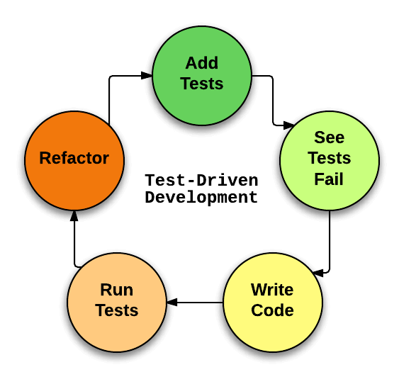

# 单元测试



先来说说`测试驱动开发（TDD，Test-Driven Development）`开发思维，在开发人员实现功能代码前，先设计好测试用例的代码，然后再根据测试用例的代码编写产品的功能代码，最终目的是让开发前设计的测试用例代码都能够顺利执行通过。传统软件开发流程中，软件开发人员先开发好功能代码，再针对这些功能设计测试用例、实现测试脚本，以此保证开发的这些功能的正确性和稳定性。这两种有非常大的不同，单元测试即属前者思维。

实施过程

1. 以欲实现的新功能添加一批测试；
2. 运行测试，看看新添加的测试是否失败；
3. 编写实现软件新功能的实现代码；
4. 再次运行测试，看是否有测试失败；
5. 重构代码；
6. 重复以上步骤直到所有测试通过。

### java 范例

- 功能：用户输入自己的生日，就可以输出还要多少天到下次生日。

- 测试用例：
    1. 用户输入空字符串或者 null：
    2. 用户输入的生日格式不符合 YYYY-MM-dd 的格式：
    3. 用户输入的生日格式正确，但是今年的生日已经过了，就应该返- 回离明年的生日还有多少天：
    4. 用户输入的生日格式正确且今年生日还没过，返回的结果应该不大于 365 天：
    5. 用户输入的生日格式正确并且是今天，返回的结果应该为 0：

- 程式码：

```java

// ＝＝＝单元测试代码＝＝＝
@Test
// 测试输入空字符串 null 时，是否抛出 "Birthday should not be null or empty" 异常
public void birthdayIsNull() {
    RuntimeException exception = null;
    try {
      BirthdayCaculator.caculate(null);
    }catch(RuntimeException e) {
      exception = e;
    }
    Assert.assertNotNull(exception);
    Assert.assertEquals(exception.getMessage(), "Birthday should not be null or empty");
}

@Test
// 测试输入空字符串 "" 时，是否抛出 "Birthday should not be null or empty" 异常
public void birthdayIsEmpty() {
    RuntimeException exception = null;
    try {
      BirthdayCaculator.caculate("");
    }catch(RuntimeException e) {
      exception = e;
    }
    Assert.assertNotNull(exception);
    Assert.assertEquals(exception.getMessage(), "Birthday should not be null or empty");
}


@Test
// 测试输入错误的时间格式，是否抛出 "Birthday format is invalid!" 异常
public void birthdayFormatIsInvalid() {
    RuntimeException exception = null;
    try {
        BirthdayCaculator.caculate("Sep 3, 1996");
    }catch(RuntimeException e) {
        exception = e;
    }
    Assert.assertNotNull(exception);
    Assert.assertEquals(exception.getMessage(), "Birthday format is invalid！");
}

@Test
// 测试用户输入的日期晚于今年生日的情况，判断是否返回离明年的生日有多少天
public void thisYearBirthdayPassed() {
    Calendar birthday = Calendar.getInstance();
    birthday.add(Calendar.DATE, -1);
    SimpleDateFormat sdf = new SimpleDateFormat("YYYY-MM-dd");
    String date = sdf.format(birthday.getTime());
    int days = BirthdayCaculator.caculate(date);
    // 天数不应该出现负数
    Assert.assertTrue(days > 0);
}

@Test
// 测试用户输入的日期早于今年生日的情况，判断返回的天数是否小于 365
public void thisYearBirthdayNotPass() {
    Calendar birthday = Calendar.getInstance();
    birthday.add(Calendar.DATE, 5);
    SimpleDateFormat sdf = new SimpleDateFormat("YYYY-MM-dd");
    String date = sdf.format(birthday.getTime());
    int days = BirthdayCaculator.caculate(date);
    // 天数不应该大于一年的天数，365 天
    Assert.assertTrue(days < 365);
}

@Test
// 测试用户输入的日期恰好等于今年生日的情况，判断返回的天数是否是 0
public void todayIsBirthday() {
    Calendar birthday = Calendar.getInstance();
    SimpleDateFormat sdf = new SimpleDateFormat("YYYY-MM-dd");
    String date = sdf.format(birthday.getTime());
    int days = BirthdayCaculator.caculate(date);
    Assert.assertEquals(days, 0);
}


// ＝＝＝功能实现代码＝＝＝

public static int caculate(String birthday) {
    // 首先对输入的日期是否是 null 或者是 "" 进行判断
    if(birthday == null || birthday.isEmpty()) {
        throw new RuntimeException("Birthday should not be null or empty");
    }

    SimpleDateFormat sdf = new SimpleDateFormat("yyyy-MM-dd");
    Calendar today = Calendar.getInstance();

    // 处理输入的日期恰好等于今年生日的情况
    if(birthday.equals(sdf.format(today.getTime()))) {
        return 0;
    }

    // 输入日期格式的有效性检查
    Calendar birthDate = Calendar.getInstance();
    try {
        birthDate.setTime(sdf.parse(birthday));
    } catch (ParseException e) {
        throw new RuntimeException("Birthday format is invalid!");
    }
    birthDate.set(Calendar.YEAR, today.get(Calendar.YEAR));

    // 实际计算的逻辑
    int days;
    if (birthDate.get(Calendar.DAY_OF_YEAR) < today.get(Calendar.DAY_OF_YEAR)) {
        days = today.getActualMaximum(Calendar.DAY_OF_YEAR) - today.get(Calendar.DAY_OF_YEAR);
        days += birthDate.get(Calendar.DAY_OF_YEAR);
    } else {
        days = birthDate.get(Calendar.DAY_OF_YEAR) - today.get(Calendar.DAY_OF_YEAR);
    }
    return days;
}
```

## 什么是单元测试？
- 单元测试为验证我们的代码是否可以按预期工作的手段。
- 单元测试特指被测试对象为程序中最小组成单元的测试。最小组成单元可以是一个函数、一个类等等。

## 单元测试的意义
1. TDD（测试驱动开发） 被证明是有效的软件编写原则，它能覆盖更多的功能接口。
2. 快速反馈你的功能输出，验证你的想法。
3. 保证代码重构的安全性，没有一成不变的代码，测试用例能给你多变的代码结构一个定心丸。
4. 易于测试的代码，说明是一个好的设计。做单元测试之前，肯定要实例化一个东西，假如这个东西有很多依赖的话，这个测试建造过程将会非常耗时，会影响你的测试效率，怎么办呢？要依赖分离，一个类尽量保证功能单一，比如视图与功能分离，这样的话，代码也便于维护和理解。

## 何时编写单元测试
- 开发过程中，单元测试应该来测试那些可能会出错的地方，或是那些边界情况。
- 维护过程中，单元测试应该围绕着 bug 进行，每个 bug 都应该编写响应的单元测试。从而保证同一个 bug 不会出现第二次。

## 单元测试过渡的作法与观念
- 优先对稳定的功能（比如一些公用组件）和核心流程编写单元测试。
- 如果项目里充斥着颗粒度低，方法间互相耦合的代码，会发现无法进行单元测试。要么重构已有代码，要么放弃单元测试寻求其他测试方法，比如人工测试，e2e 测试(後面篇幅有介紹)。
- 前端是一个非常复杂的测试环境，单元测试只能对功能每一个单元进行测试，对于一些依赖 api 的数据一般只能 mock，无法真正的模拟用户实际的使用场景。对于这种情况，建议采用其他测试方法，比如人工测试、e2e 测试。这也是为何我们要多做 e2e 测试。
- 在 Vue 开发的项目，我们要测试功能型组件、vue 插件、二次封装的库。

## 单元测试思维
1. 单元测试没有标准答案。
2. 软件的质量不是测试出来的，而是设计和维护出来的。
3. 粒度是多少，不重要，重要的是你软件应该怎么做，怎么测试。
4. 先写测试，后写功能。

## 编写单元测试用例
#### ▶ 原则：
- 测试代码时，只考虑测试，不考虑内部实现
- 数据尽量模拟现实，越靠近现实越好
- 充分考虑数据的边界条件
- 对重点、复杂、核心代码，重点测试
- 利用测试夹具 (beforeEach、afterEach), 减少测试代码数量，避免无用功能
- 测试、功能开发相结合，有利于设计和代码重构

[单元测试 27 条准则](https://github.com/yangyubo/zh-unit-testing-guidelines)

#### ▶ 单元测试程式码
##### ✓ Step1 先做测试条件：

```js
import factorial frome '../index';  // 导入检测程式码模组或类

describe('test testObject', () => {
    beforeAll(() => {
        // Create any objects that we might need
    });
    test('equals -1 for sets of NaN', () => {
        expect(factorial(-1)).toBeNaN();
    });
    test('equals 1 for sets of zero length', () => {
        expect(factorial(0)).toBe(1);
    });
    test('equals 1 for sets of length one', () => {
        expect(factorial(1)).toBe(1);
    });
    test('equals 2 for sets of length two', () => {
        expect(factorial(2)).toBe(2);
    });
    test('equals 6 for sets of length three', () => {
        expect(factorial(3)).toBe(6);
    });
});
```

##### ✓ Step2 再完成业务程式码：

```js
module.exports = function (n) {
    if (n < 0) return NaN;
    if (n === 0) return 1;
    return n * factorial(n - 1);
};
```

## 一个单元测框架框架含四部分
- 测试运行器 Test Runner (可使用 edp-test, karma）
- 测试框架 Testing Framework (可使用 jasmine, mocha, qunit, Jest）
- 断言库 Assertion library: (可使用 expect.js, should, chai,)
- 覆盖率 Coverage library: (可使用 istanbul)

## 单元测试编写步骤
#### 基本测试脚本架构
- describe 是`测试套件（test suite）`，表示一组相关的测试。它是一个函数，第一个参数是测试套件的名称（"加法函数的测试"），第二个参数是一个实际执行的函数。
- test 是`测试用例"（test case）`，表示一个单独的测试，是测试的最小单位。它也是一个函数，第一个参数是测试用例的名称，第二个参数是一个实际执行的函数。所有的测试用例（test 块）都应该含有一句或多句的断言。

```js
describe('HelloWorld.vue', () => {
	test('should render correct contents', () => {
		// 断言库
		expect(content).to.equal('Welcome to Your Vue.js App')
	})
})
```

#### 一组单元测试包含
- 准备阶段：构造参数，创建 spy(监控对象) 等
- 执行阶段：用构造好的参数执行被测试代码
- 断言阶段：用实际得到的结果与期望的结果比较，以判断该测试是否正常
- 清理阶段：清理准备阶段对外部环境的影响，移除在准备阶段创建的 spy 等

```js
describe('Addition', () => {
    test('knows that 2 and 2 make 4', () => {
        const val1 = 2; // 准备阶段
        const val2 = 2; // 准备阶段
        const result = val1 + val2; // 执行阶段
        const expectedResult = 4;
        expect(result).toBe(expectedResult); // 断言阶段
        ....  // 清理阶段，如有需要清理，最后做清理动作
    });
});
```

## 單元测试的难点
单元测试无非就是用驱动代码去调用被测函数，并根据代码的功能逻辑选择必要的输入数据的组合，然后验证执行被测函数后得到的结果是否符合预期。但有以下难点
1. 单元测试用例`输入参数`的复杂性；
    - 被测试函数的输入参数
    - 被测试函数内部需要读取的全局静态变量
    - 被测试函数内部需要读取的类成员变量
    - 函数内部调用子函数获得的数据
    - 函数内部调用子函数改写的数据
    - 嵌入式系统中，在中断调用中改写的数据
2. 单元测试用例`预期输出`的复杂性；
    - 被测函数的返回值
    - 被测函数的输出参数
    - 被测函数所改写的成员变量和全局变量
    - 被测函数中进行的文件更新、数据库更新、消息队列更新等
3. 关联依赖的代码不可用。
