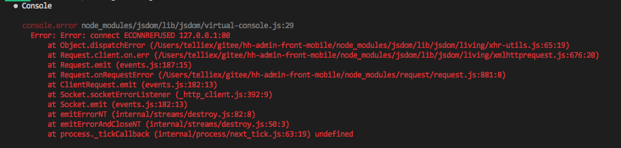
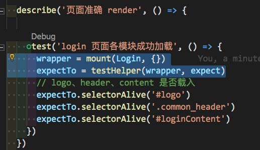
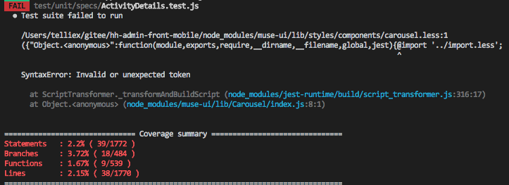
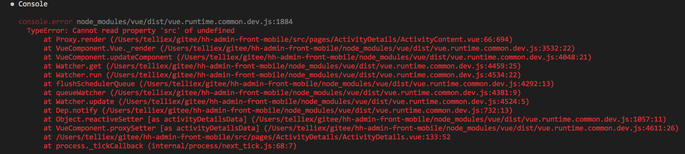

# 实作
Vue 框架下的单元测试采用 `Jest`，提交覆盖率为`80％`

#### 安装
1. VS Code 中运行，可安装 Jest 插件，自动的运行测试代码
2. 使用 vue 脚手架安装过 Jest ，可跳过下面安装

✓ Step1- 通过 npm 或 yarn 进行安装
```
npm install jest --dev-save
// or
yarn add jest --dev
```
✓ Step2- package.json 中指定 test 脚本
```
{
    "scripts": {
        "test": "jest"
    }
}
```

##### jest.conf.js 设定
```js
rootDir: path.resolve(__dirname, '../../'),
moduleFileExtensions: [ // 目标档案类型
    'js',
    'json',
    'vue'
],
moduleNameMapper: { 
	'\\.(css|styl|less|sass|scss)$': '<rootDir>/test/unit/styleMock.js', // import less 问题
    '^@/(.*)$': '<rootDir>/src/$1'
},
transform: { // 档案类型对应的插件做 JavaScript 处理器
	'\\.(jpg|jpeg|png|gif|eot|otf|webp|svg|ttf|woff|woff2|mp4|webm|wav|mp3|m4a|aac|oga)$': '<rootDir>/test/unit/assets.transform.js',
    '^.+\\.js$': '<rootDir>/node_modules/babel-jest',
    '.*\\.(vue)$': '<rootDir>/node_modules/vue-jest',
    '\\.(css|styl|less|sass|scss)$': '<rootDir>/test/unit/styleMock.js'
},
testURL: 'http://localhost/', // jsdom 环境下运行需设置，避免报错(如下)
testPathIgnorePatterns: ['<rootDir>/test/e2e'],
snapshotSerializers: ['<rootDir>/node_modules/jest-serializer-vue'],
setupFiles: ['<rootDir>/test/unit/setup'],
// mapCoverage: true, // 移除,不再支援
collectCoverage: true,
coverageDirectory: '<rootDir>/test/unit/coverage',
collectCoverageFrom: ['src/**/*.{js,vue}', '!src/main.js', '!src/router/index.js', '!**/node_modules/**', '!**/node_modules/**'],
coverageReporters: [
  'lcov', // 会生成 lcov 测试结果以及 HTML 格式的漂亮的测试覆盖率报告
  'text' // 会在命令行界面输出简单的测试报告
]

```

## 问题搜集
1. process.env 變數問題
https://codeday.me/bug/20181231/475969.html



检查单元测试内 mount，是否有未释放


进页面的 API 呼叫需放到 created() ，勿放到 mounted()
```
created () {
  this.getCmsDetail()
},

methods: {
	async getCmsDetail (){
		await axios.get(process.env.API_ROOT + 'CMS/CntDetail', {
	        params: {
	          contCoverId: this.contCoverId
	        }
	     })
	}
}
```
import Less 



jest.conf.js 加入
```javascript
 moduleNameMapper: {
	 ...
    '\\.(css|styl|less|sass|scss)$': '<rootDir>/test/unit/styleMock.js',
  },
 transform: {
	 ...
    '\\.(less)$': '<rootDir>/test/unit/styleMock.js'
  },
```
建立 styleMock.js
```
module.exports = {
  process () {
    return ''
  }
};
```
引用时可以用 mock 方式
```
jest.mock("../../src/styles.less", () => jest.fn());
```


vue.runtime.commom.dev.js


表示返回的格式有误


[Jest CSS Modules](https://www.npmjs.com/package/jest-css-modules)
[jest-transform-stub]()
