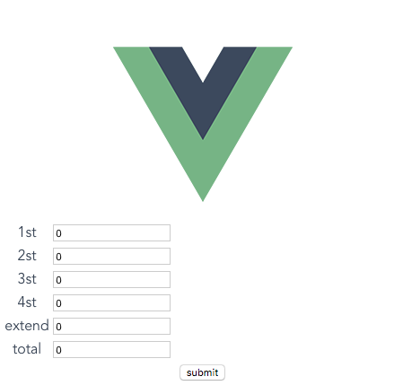

# Jest 实战范例 2
这里实作一个简单的功能，说明`单元测试与覆盖率`的关系（这暂不考虑测试先行情况）。

功能需求：增减 1st、2st、3st、4st、extend 五个栏位的数值，单个栏位新增超過 1 的話會 alert 警告，一次增减兩个栏位以上的話也會顯示 alert 警告。

先看到下图视图画面，

功能代码（记得安装 lodash）。
```vue
// ➔ HelloWorld.vue
<template>
	<div>
		<table>
			<tr>
				<td>1st</td>
				<td>
					<input type="number" v-model.number="scores.firstSection">
				</td>
			</tr>
			<tr>
				<td>2st</td>
				<td>
					<input type="number" v-model.number="scores.twoSection">
				</td>
			</tr>
			<tr>
				<td>3st</td>
				<td>
					<input type="number" v-model.number="scores.threeSection">
				</td>
			</tr>
			<tr>
				<td>4st</td>
				<td>
					<input type="number" v-model.number="scores.fourSection">
				</td>
			</tr>
			<tr>
				<td>extend</td>
				<td>
					<input type="number" v-model.number="scores.extendSection">
				</td>
			</tr>
			<tr>
				<td>total</td>
				<td>
					<input type="number" v-model.number="total">
				</td>
			</tr>
		</table>
		<input type="button" value="submit" @click="submit">
	</div>
</template>
<script>
import _ from 'lodash'
// 兩数相减的正数值
function mathDistance (num1, num2) {
	return num2 > num1 ? num2 - num1 : num1 - num2
}
export default {
	name: 'hello',
	data () {
		return {
			scores: {
				firstSection: 0,
				twoSection: 0,
				threeSection: 0,
				fourSection: 0,
				extendSection: 0
			},
			cloneScores: {}
		}
	},
	computed: {
		total () {
			return this.scores.firstSection + this.scores.twoSection + this.scores.threeSection +
			this.scores.fourSection + this.scores.extendSection
		}
	},
	methods: {
		submit () {
			let scores = this.scores
			let modifedObject = _.reduce(this.cloneScores, function (result, value, key) {
				return _.isEqual(value, scores[key]) ? result : result.concat(key)
			}, [])
			let isDistanceScore = false
			modifedObject.forEach(property => {
				if (mathDistance(this.cloneScores[property], this.scores[property]) > 1) {
					isDistanceScore = true
				}
			})
			if (isDistanceScore) alert('只能增加或減少一分')
			if (modifedObject.length > 1) alert('只能更新一節的分數')
		}
	},
	created () {
		this.cloneScores = { ...this.scores }
	}
}
</script>
<!-- Add "scoped" attribute to limit CSS to this component only -->
<style scoped>
</style>
```

### 单元测试代码 version 1
```js
// ➔ HelloWorld.test.js
import Component from '@/components/HelloWorld.vue'
describe('Component', () => {
	test('總分為所有節數加起來的分數', () => {
		console.log('test')
	})
})

```

检视结果：


从上图我们可以发现，单元测试仅一条，判断结果也是 console.log 而已，完全无法达到覆盖率。

### 单元测试代码 version 2
修改单元测试代码
```js
// ➔ HelloWorld.test.js
// 使用 shallow 可以只 foucs 在要測試的元件，保証隔離了子元件，如果要一併測試子元件的話，需要使用 mount
import { shallow } from 'vue-test-utils'
import Component from '@/components/HelloWorld.vue'
describe('Component', () => {
	let wrapper, vm, alert
	beforeEach(() => {
		wrapper = shallow(Component)
		vm = wrapper.vm // 這個可以取到元件裡面的東西，比如說 data 裡的變數或直接調用方法
		alert = jest.spyOn(window, 'alert') // 這邊則是使用 jest 來 spy alert 這個物件
	})
	afterEach(() => {
		alert.mockRestore() // 每次測試完都得restore
	})
	test('總分為所有節數加起來的分數', () => {
		wrapper.setData({
			scores: {
				firstSection: 1,
				twoSection: 2,
				threeSection: 3,
				fourSection: 5,
				extendSection: 0
			}
		})
	expect(vm.total).toEqual(11) // 這邊的expect是使用jest的，對我來說很夠用了
	})
	test('不可以加或減超過一分', () => {
		vm.scores.firstSection = 2
		vm.submit()
		expect(alert.mock.calls[0][0]).toEqual('只能增加或減少一分')
	})
	test('只能更新一節的分數', () => {
		vm.scores.firstSection = 1
		vm.scores.twoSection = 1
		vm.submit()
		expect(alert.mock.calls[0][0]).toEqual('只能更新一節的分數')
	})
	test('不可以加或減超過一分且只能更新一節的數分', () => {
		vm.scores.firstSection = 2
		vm.scores.twoSection = 1
		vm.submit()
		expect(alert.mock.calls[0][0]).toEqual('只能增加或減少一分')
		expect(alert.mock.calls[1][0]).toEqual('只能更新一節的分數')
	})
})
```

检视结果：


以上我们可以发现，在 branch 上，我们还没达到 100%，且告知未完全覆盖的地方是在 48 行，也就是  mathDistance() 的判断少了一种情况。


### 单元测试代码 version 3 (达到覆盖率 100%)
```js
// ➔ HelloWorld.test.js
// 使用 shallow 可以只 foucs 在要測試的元件，保証隔離了子元件，如果要一併測試子元件的話，需要使用 mount
import { shallow } from 'vue-test-utils'
import Component from '@/components/HelloWorld.vue'


describe('Component', () => {
  let wrapper, vm, alert

  beforeEach(() => {
    wrapper = shallow(Component)
    vm = wrapper.vm // 這個可以取到元件裡面的東西，比如說 data 裡的變數或直接調用方法
    alert = jest.spyOn(window, 'alert') // 這邊則是使用 jest 來 spy alert 這個物件
  })

  afterEach(() => {
    alert.mockRestore() // 每次測試完都得 restore
  })

  test('總分為所有節數加起來的分數', () => {
    wrapper.setData({
      scores: {
        firstSection: 1,
        twoSection: 2,
        threeSection: 3,
        fourSection: 5,
        extendSection: 0
      }
    })
    expect(vm.total).toEqual(11) // 這邊的expect是使用jest的，對我來說很夠用了
  })

  test('不可以加超過一分', () => {
    vm.scores.firstSection = 2
    vm.submit()

    expect(alert.mock.calls[0][0]).toEqual('只能增加或減少一分')
  })

  test('不可以減超過一分', () => {
    vm.scores.twoSection = -2
    vm.submit()

    expect(alert.mock.calls[0][0]).toEqual('只能增加或減少一分')
  })

  test('只能更新一節的分數', () => {
    vm.scores.firstSection = 1
    vm.scores.twoSection = 1
    vm.submit()
    expect(alert.mock.calls[0][0]).toEqual('只能更新一節的分數')
  })

  test('不可以加或減超過一分且只能更新一節的數分', () => {
    vm.scores.firstSection = 2
    vm.scores.twoSection = 1
    vm.submit()
    expect(alert.mock.calls[0][0]).toEqual('只能增加或減少一分')
    expect(alert.mock.calls[1][0]).toEqual('只能更新一節的分數')
  })
})
```
检视结果：


如此，便可达到 100 % 覆盖率。

## 参考
- [demo gitlab](https://github.com/telliex/shinho-ut-demo2)
- [使用jest和官方的vue test utils來寫單元測試(vue單元測試系列-5)](https://dotblogs.com.tw/kinanson/2017/10/17/222548)

## 除错
操作过程，你可能会遇到下面问题
#### 问题: window.alert 不支援


解法：in your setup.js
```js
// setup.js
Vue.config.productionTip = false
window.alert = msg => {
  console.log(msg)
}
```
设置设定档
```js
// jest.conf.js
const path = require('path')

module.exports = {
  rootDir: path.resolve(__dirname, '../../'),
  moduleFileExtensions: ['js', 'json', 'vue'],
  moduleNameMapper: {
    '^@/(.*)$': '<rootDir>/src/$1'
  },
  testURL: 'http://localhost/', // 避免 SecurityError: localStorage is not available for opaque origins 错误
  transform: {
    '^.+\\.js$': '<rootDir>/node_modules/babel-jest',
    '.*\\.(vue)$': '<rootDir>/node_modules/vue-jest'
  },
  testPathIgnorePatterns: ['<rootDir>/test/e2e'],
  snapshotSerializers: ['<rootDir>/node_modules/jest-serializer-vue'],
  setupFiles: ['<rootDir>/test/unit/setup'],
  // mapCoverage: true, // 移除,不再支援
  collectCoverage: true,
  coverageDirectory: '<rootDir>/test/unit/coverage',
  collectCoverageFrom: ['src/**/*.{js,vue}', '!src/main.js', '!src/router/index.js', '!**/node_modules/**', '!**/node_modules/**','!src/App.vue'],
  coverageReporters: [
    'lcov', // 会生成lcov测试结果以及HTML格式的漂亮的测试覆盖率报告
    'text' // 会在命令行界面输出简单的测试报告
  ]
}
```
## 覆盖率


- 语句覆盖率（statement coverage）：是否每个语句都执行了
- 分支覆盖率（branch coverage）：是否每个 if 代码块都执行了
- 函数覆盖率（function coverage）：是否每个函数都调用了
- 行覆盖率（line coverage）：是否每一行都执行了
