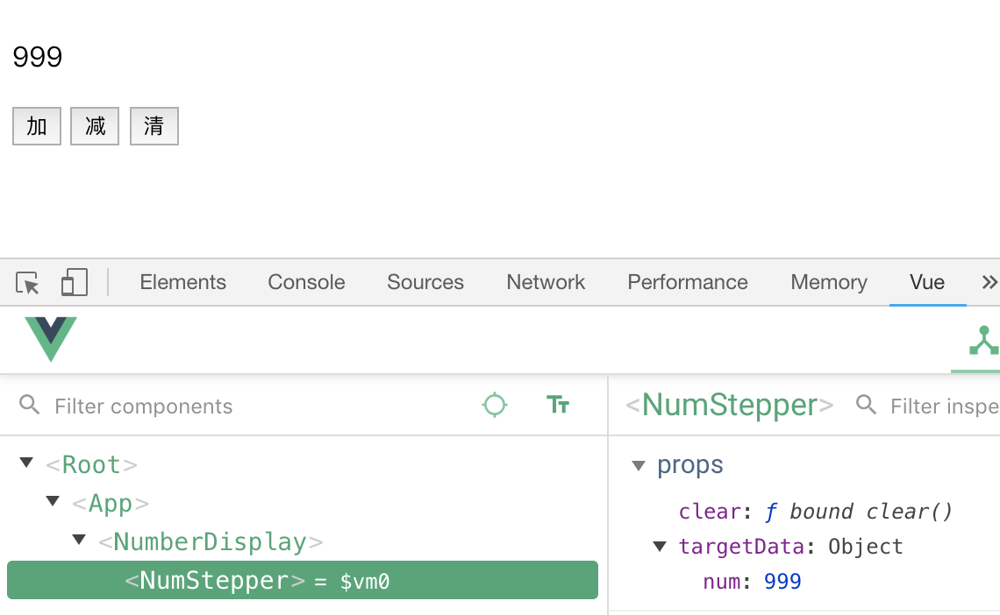

# Jest 实战范例 3

对于 UI 组件来说，不推荐一味追求行级覆盖率，它会导致我们过分关注组件的内部实现细节，从而导致琐碎的测试。将测试重心放在组件的公共接口，组件内部如同一个黑盒，我们只在乎输入输出。

比如，对于每次点击按钮都会将计数加一的 Counter 组件来说，其测试用例将会模拟点击并断言渲染结果会加 1。该测试并没有关注 Counter 如何递增数值，而只关注其输入和输出。





``` js
//NumStepper.vue

<template>
  <div>
    <button class="plus" v-on:click="updateNumber(+1)">加</button>
    <button class="minus" v-on:click="updateNumber(-1)">减</button>
    <button class="zero" v-on:click="clear">清</button>
  </div>
</template>

<script>
export default {
  props: {
    targetData: Object,
    clear: Function
  },
  methods: {
    updateNumber: function(n) {
      this.targetData.num += n;
    }
  }
}
</script>

```

```js
//NumberDisplay.vue

<template>
  <div>
    <p>{{somedata.num}}</p>
    <NumStepper :targetData="somedata" :clear="clear" />
  </div>
</template>

<script>
import NumStepper from "./NumStepper"

export default {
  components: {
    NumStepper
  },
  data() {
    return {
      somedata: {
        num: 999
      },
      tgt: this
    }
  },
  methods: {
    clear: function() {
      this.somedata.num = 0;
    }
  }
}
</script>
```
### 单元测试
```js
import { shallowMount } from "@vue/test-utils";
import Vue from 'vue';
import NumStepper from '@/components/NumStepper';
import NumberDisplay from '@/components/NumberDisplay';

describe("测试 NumStepper 组件", ()=>{
  test("应该能够影响外层组件的数据", ()=>{
    // shallowMount 方法只挂载一个组件而不渲染其子组件 (即保留它们的存根)
    const display = shallowMount(NumberDisplay);

    const wrapper = shallowMount(NumStepper, {
      propsData: {
        targetData: display.vm.somedata,
        clear: display.vm.clear
      }
    });

    expect(display.vm.somedata.num).toBe(999);

    wrapper.find('.plus').trigger('click');
    wrapper.find('.plus').trigger('click');
    expect(display.vm.somedata.num).toBe(1001);

    wrapper.find('.minus').trigger('click');
    expect(display.vm.somedata.num).toBe(1000);

    wrapper.find('.zero').trigger('click');
    expect(display.vm.somedata.num).toBe(0);
  })
});
```
### 加入 mock
```js
//NumStepper2.vue

<template>
  <div>
    <button class="plus" v-on:click="updateFunc(+1)">加</button>
    <button class="minus" v-on:click="updateFunc(-1)">减</button>
    <button class="zero" v-on:click="clearFunc">清</button>
  </div>
</template>

<script>
export default {
  props: {
    updateFunc: Function,
    clearFunc: Function
  }
}
</script>
```

```js
import { shallowMount } from "@vue/test-utils";
import Vue from 'vue';
import NumStepper from '@/components/NumStepper2';

describe("测试 NumStepper 组件", ()=>{
  it("应该能够影响外层组件的数据", ()=>{

    const obj = {
      func1: function(){},
      func2: function(){}
    };

    const spy1 = jest.spyOn(obj, "func1");
    const spy2 = jest.spyOn(obj, "func2");

    const wrapper = shallowMount(NumStepper, {
      propsData: {
        updateFunc: spy1,
        clearFunc: spy2
      }
    });

    wrapper.find('.plus').trigger('click');
    expect(spy1).toHaveBeenCalled();

    wrapper.find('.minus').trigger('click');
    expect(spy1).toHaveBeenCalled();

    wrapper.find('.zero').trigger('click');
    expect(spy2).toHaveBeenCalled();
  })
});

```

## 参考
- [实例入门 Vue.js 单元测试](https://juejin.im/post/5bd0979f5188251fab50a551)
- [Vue Test Utils 常用技巧](https://vue-test-utils.vuejs.org/zh/guides/common-tips.html)
