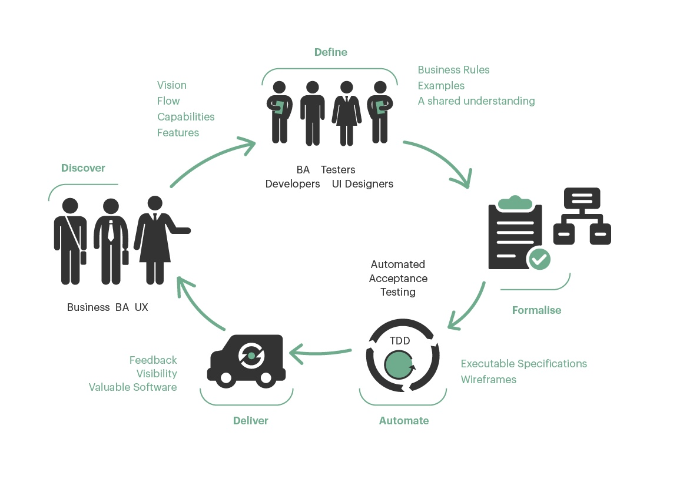
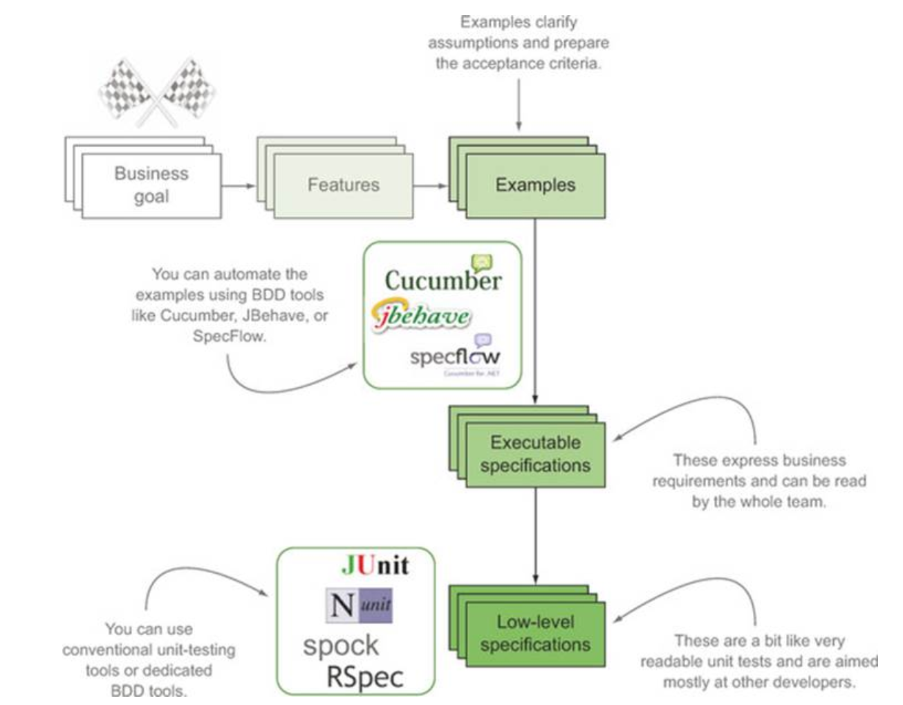
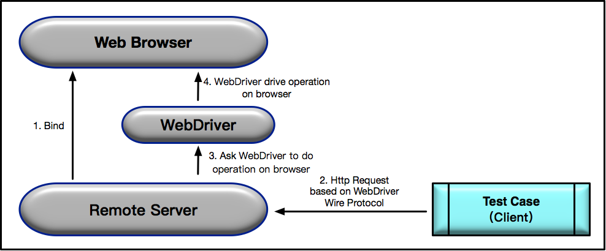

# DBB 测试

**BDD (Behavior Driven Development)**，行为驱动开发是一种敏捷软件开发的技术，它鼓励软件项目中的**开发者**、**QA** 和**非技术人员或商业参与者**之间的协作。BDD 主要是用来作**验收测试**。


::: tip 特性：由非开发人员编写测试用例，测试用例是使用自然语言编写的 DSL（领域特定语言）。
* 当我在网站的首页
* 输入用户名 "demo"
* 输入密码 "mode"
* 提交登录信息
* 用户应该跳转到欢迎页
:::

## BDD 过程
1. 从业务的角度定义具体的，以及可衡量的目标
3. 找到一种可以达到设定目标的、对业务最重要的那些功能的方法
4. 然后像故事一样描述出一个个具体可执行的行为。其描述方法基于一些通用词汇，这些词汇具有准确无误的表达能力和一致的含义。例如，expect, should, assert
4. 寻找合适语言及方法，对行为进行实现
5. 测试人员检验产品运行结果是否符合预期行为。最大程度的交付出符合用户期望的产品，避免表达不一致带来的问题


## 欣和 BDD 自动化测试工具 Cucumber.js & Robot Framework
### 前端人员使用 Cucumber.js (javascript)
#### DSL Code Examples
```
# language: zh-CN
功能: 失败的登录
  作为一名已注册使用者
  能用帐号密码登入
  这样我能进入平台进行作业

  场景大纲: 失败的登录
    假设 当我在网站的首页
    当 输入用户名 <用户名>
    当 输入密码 <密码>
    当 提交登录信息
    那么 页面应该返回 "Error Page"

    例子:
      |用户名     |密码      |
      |'Jan1'    |'password'|
      |'Jan2'    |'password'|
```

#### Step Code Examples

```js
const { Given, When, Then } = require("cucumber");

Given('当我在网站的首页', function() {
    return this.driver.get('http://0.0.0.0:7272/');
});

When('输入用户名 {string}', function (text) {
    return this.driver.findElement({id:'username_field'}).sendKeys(text)
});

When('输入密码 {string}', function (text) {
    return this.driver.findElement({id:'password_field'}).sendKeys(text)
});

When('提交登录信息', function () {
    return this.driver.findElement({id:'login_button'}).click()
});

Then('页面应该返回 {string}', function (string) {
    this.driver.getTitle().then(function(title) {
    expect(title).to.equal(string);
    });
});

```

### 测试人员使用 Robot Framework (python)
#### DSL Code Examples
```
*** Settings ***
Documentation     登录测试 2
...
Suite Setup       打开浏览器到登录页1
Suite Teardown    Close Browser
Test Setup        转到登录页
Test Template     使用错误的失败凭据应该登录失败
Resource          resource.robot

*** Test Cases ***               USER NAME        PASSWORD
无效的用户名                      invalid          ${VALID PASSWORD}
无效的密码                        ${VALID USER}    invalid
无效的用户名和密码                 invalid          whatever

*** Keywords ***
使用错误的失败凭据应该登录失败
    [Arguments]    ${username}    ${password}
    输入用户名    ${username}
    输入密码    ${password}
    提交登录信息
    登录应该不成功

登录应该不成功
    Location Should Be    ${ERROR URL}
    Title Should Be    Error Page
```

#### Step Code Examples
```
打开浏览器到登录页
    Open Browser    ${LOGIN URL}    ${BROWSER}
    Maximize Browser Window
    Set Selenium Speed    ${DELAY}
    Login Page Should Be Open

Login Page Should Be Open
    Title Should Be    Login Page

转到登录页
    Go To    ${LOGIN URL}
    Login Page Should Be Open

输入用户名
    [Arguments]    ${username}
    Input Text    username_field    ${username}

输入密码
    [Arguments]    ${password}
    Input Text    password_field    ${password}

提交登录信息
    Click Button    login_button

应该跳转到欢迎页
    Location Should Be    ${WELCOME URL}
    Title Should Be        Welcome Page
```


---
<此部份待补完>
故事映射（Story Mapping）

TDD、ATDD、实例化需求（Specification by Example）？

清晰的验收场景能够帮助我们理解要创建什么、不要创建什么，并且理解为什么这样选择。

[BDD 工具 Cucumber 十周岁：创建者 Aslak Hellesøy 访谈](https://www.infoq.cn/article/2018/05/cucumber-bdd-ten-years)

---


## software lifecycle



▵ 当 Feature 和 Example 文件都完成后，借助于第三方的开源框架 **Cucumber** 把 Feature 和 Example 转换成代码，然后通过底层次的单元测试框架 Jest，结合测试驱动开发，从而把业务代码的逻辑实现。


## Selenium 2.0 ，又称 Selenium WebDriver (Cucumber.js 的搭当)



Selenium 是一个浏览器自动化框架，您可以利用它的 WebDriver 对象操作真实浏览器和网页，并使用 CSS 或 XPath 选择器在屏幕上定位元素。WebDriver 针对各种不同的浏览器有不同的实现，它还能运行没有 GUI 的浏览器，它也叫无头(headless)浏览器。


web_driver.js
```js
// 引入 Chrome驱动
require('chromedriver');
// 引入Selenium-Webdriver
const webDriver = require('selenium-webdriver');

//根据您的浏览器配置创建 WebDriver 实例;
function createDriver() {
    let browserConfig = process.env.BROWSER || 'chrome';
    let browser = browserConfig.toLowerCase();
    if (['chrome', 'firefox', 'ie'].indexOf(browser) < 0) browser = 'chrome'; //default to chrome
    return new webDriver.Builder().forBrowser(browser).build();
}

exports.driver = createDriver();
```

#### 元素定位方法
- 通过 css 查找元素
```js
require('chromedriver')

const { Builder } = require('selenium-webdriver')

let driver = new Builder().forBrowser('chrome').build()

driver.get('http://www.baidu.com')

// 使用 css 路径选择器查找元素
driver.findElement({css:'#kw'}).sendKeys('CukeTest')
```
- 通过 link_text 查找元素
```js
require('chromedriver')

const { Builder } = require('selenium-webdriver')

let driver = new Builder().forBrowser('chrome').build()

driver.get('http://www.baidu.com')

// 使用 linkText 查找元素

driver.findElement({linkText:'新闻'}).click()
```
- 通过 partialLinkText 查找元素
```js
require('chromedriver')

const { Builder } = require('selenium-webdriver')

let driver = new Builder().forBrowser('chrome').build()

driver.get('http://www.baidu.com')

// 使用 partialLinkText 查找元素

driver.findElement({partialLinkText :'闻'}).click()

```
- 通过 tagName 查找元素


#### Web Element 操作方法

| 方法名     | 解释   | 示例  |
| :-------- | :--------| :--- |
| click()  | 点击元素 | driver.findElement({id:'xxx'}).click() |
| clear()  | 情况输入框 | driver.findElement({id:'xxx'}).clear() |
| sendKeys(value) | 输入文本信息 | driver.findElement({id:'xxx'}).sendKeys("hello world") |
| getText() | 获取 web 元素文本值 | driver.findElement({id:'xxx'}).getText() |

#### Actions 类模拟复杂操作
```js
const actions = driver.actions();

await actions     
     .keyDown(SHIFT)
     .move({origin: el})
     .press()
     .release()
     .keyUp(SHIFT)
     .perform(); // 动作调用完毕以后必须调用perform()方法才能运行
```
#### 浏览器本身行为控制
```js
require('chromedriver')

const {Builder} = require('selenium-webdriver')

let driver = new Builder().forBrowser('chrome').build()

driver.get('https://www.baidu.com')

driver.findElement({linkText:"新闻"}).click()

driver.navigate().back()

driver.navigate().forward()

driver.navigate().refresh()
```
```js
require('chromedriver')

const {Builder} = require('selenium-webdriver')

let driver = new Builder().forBrowser('chrome').build()

driver.get('https://www.baidu.com')

driver.findElement({linkText:"新闻"}).click()

driver.manage().window().maximize()

driver.manage().window().minimize()

driver.manage().window().fullscreen()

driver.close()

driver.quit() 
```

#### 切换 iframe
```js
var webdriver = require('selenium-webdriver')

let driver = new webdriver.Builder().forBrowser('chrome').build()

async function run (){
    await driver.get('https://login.anjuke.com/login/form')

    //取frame的id值，切换到frame中
    await driver.switchTo().frame('iframeLoginIfm')

    //进行表单操作
    await driver.findElement({id:'phoneIpt'}).sendKeys('123456')

}

run()
```
#### JavaScript 方法
##### 为日期控件设置值
```js
require('chromedriver')

let { Builder } = require('selenium-webdriver')

const driver = new Builder().forBrowser('chrome').build();

driver.get('https://ant.design/components/date-picker-cn/')

driver.executeScript(function(){
    let date = new Date().toLocaleDateString()
    document.querySelector('.ant-calendar-picker-input.ant-input').value=date
})
```

##### 滚动视图
```js
require('chromedriver');

let { Builder } = require('selenium-webdriver');

const driver = new Builder().forBrowser('chrome').build();

driver.get('https://ant.design/components/date-picker-cn/');

driver.executeScript(function(){
    //调用JavaScript视图滚动方法
    document.querySelector('#guoji').scrollIntoView();

})

driver.takeScreenshot('<your file path>');
```

[selenium api ](https://seleniumhq.github.io/selenium/docs/api/javascript/module/selenium-webdriver/chrome_exports_Driver.html)

其他工具
- [autoit](https://www.autoitscript.com)
- [LeanRunner](www.leanpro.cn/leanrunner)

### 页面对象模型

页面对象模型(Page Object，或 PO)是一种设计模式，它将页面上的页面和元素表示为面向对象的类。当您需要与屏幕上的元素交互时，您不直接调用 WebDriver。而是在类上调用方法表示页面上的元素。

页面对象模型的核心理念是，以页面（Web Page 或者 Native App Page）为单位来封装页面上的控件以及控件的部分操作。而测试用例，更确切地说是操作函数，基于页面封装对象来完成具体的界面操作，最典型的模式是“XXXPage.YYYComponent.ZZZOperation”。

用于对繁杂又重复的操作可以封装管理。

让我们以登录页面应用为例，编写如下的 `login_page.js` 文件：
```js
let {driver} = require('./support/web_driver')

class LoginPage {
    
    constructor(){
        this.Base_Url = "http://localhost";
        this.Login_Css_selector='#login';
        this.UserName_Css_selector="#name";
        this.PassWord_Css_selector="#pass";
        this.Login_Btn_Css_selector="#login";
        this.error_msg_Css_selector=".error";
        this.index_Csss_selector='.index';
    }

    async go_Home() {
        await driver.get(this.Base_Url)
    }

    async go_LoginPage(){
        await driver.findElement({css:this.Login_Css_selector}).click();
    }

    async set_UserName(username){
        await driver.findElement({css:this.UserName_Css_selector}).sendKeys(username);
    }

    async set_PassWord(pass){
        await driver.findElement({css:this.PassWord_Css_selector}).sendKeys(pass)
    }

    async click_Login_btn(){
        await driver.findElement({css:this.Login_Btn_Css_selector}).click();
    }

    async action_login(username,passwd){
        await this.set_UserName(username);
        await this.set_PassWord(passwd);
        await this.click_Login_btn();
    }
}

module.exports = new LoginPage();
```


根据上面定义的 PO 模型，在步骤定义 (definition.js) 中实现 feature 的代码

```js
var { Given, When, Then } = require('cucumber')
const assert = require('assert');
const LoginPage = require('./login_page')
const {driver} = require('./support/web_driver')

Given(/^我浏览到Web应用程序而我尚未登录$/, async function () {
    await LoginPage.go_Home()
});

Given(/^浏览到网站首页$/, async function () {
     await LoginPage.go_Home()
});

When(/^点击登录按钮应该跳转到登录页面$/, async function () {
    await LoginPage.click_Login_btn()
    let page_url = await driver.getCurrentUrl()
    assert.equal(page_url,'http://localhost/login')
});

When(/^我使用无效用户登录$/, async function () {
    await LoginPage.action_login('无效用户名','无效密码');

});

When(/^我看到"([^"]*)"错误消息$/, async function (msg) {
    let text = await driver.findElement({css:LoginPage.error_msg_Css_selector}).getText();
    assert.equal(text,msg)
});

When(/^我使用有效用户登录$/, async function () {
    await LoginPage.action_login('user','pass')
});

When(/^我看到一个"([^"]*)"页面$/, async function (arg1) {
    let text = await driver.findElement({ css: LoginPage.index_Css_selector }).getText();
    assert.equal(text, msg)
});
```


[Selenium系列教程](https://juejin.im/post/5b0e19e651882515674342f8)

---
<此部份待补完>
数据驱动测试的思想

---
