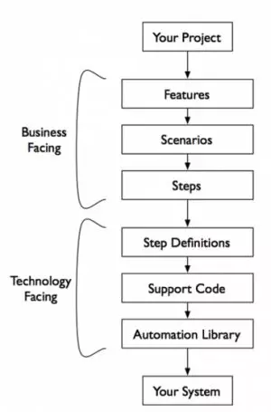
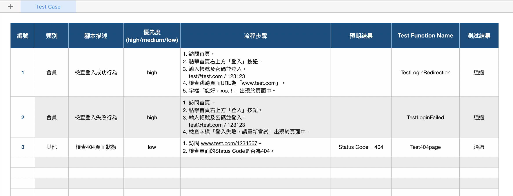

# Cucumber


## Cucumber 是什么
**Cucumber** 是行为驱动开发（BDD）模式下实现**可执行规范**（Executable Specifications）的开源工具，但是它的使命并不局限于做自动化验收测试，更加重要的在于其能够在团队成员之间**构建统一的交流基础（feature 文件）、规范交流用语（Domain Specific Language）、提高各个利益相关方（Business Stakeholders）沟通效率和效果，从而达到提升产品质量、做成客户期望得到的产品这一最终目标**。

Cucumber 之所以受到如此的推崇，在于可执行规范（Executable Specifications），可执行规范有两个含意

- **可执行性**（Executable）：从技术人员的视角来看，可以像执行代码（Java、Ruby...）一样运行这些规范，来验证、验收目标应用。
- **规范性**（Specification）：从非技术人员的视角触发，相比验证本身，他们更加关心系统功能的清晰描述：系统在什么场景下能够做什么样的事情。

Cucumber 融合了以上两个含意做到技术人员和非技术人员交流的桥梁。

从需求分析到生产环境中的代码开发，通过`可执行规范`与`自动化测试`支撑着整个流程。

以自动柜员机（ATM）为例，Cucumber 实作步骤如下
1. 创建 feature 文件（剧本文件）
2. 生成测试 Step Definitions（步骤定义）
3. 运行测试用例


### Step1: 创建 feature 文件
Cucumber 把`需求规格说明书`、`自动化测试`和`在线文档`合并成了一种格式 Gherkin
中文描述
```
# language: zh-CN
功能: 使用 ATM 固定金额方式取款
  通常“取款”菜单包含了几个固定金额，使用这些固定金额取款可以避免从键盘输入提取金额，从而可以加速交易，提高取款的效率。
 
  场景大纲: 固定金额取款
    假如 我的账户中有余额<accountBalance>元
    当 我选择固定金额取款方式取出<withdrawAmount>元
    那么 我应该收到现金<receivedAmount>元
    而且 我账户的余额应该是<remainingBalance>元
    例子:
      | accountBalance | withdrawAmount | receivedAmount | remainingBalance |
      | 1000.00 | 100.00 | 100.00 | 900.00 |
      | 500.00 | 500.00 | 500.00 | 0.00 |
```
英文描述(预设)
```
Feature: 使用 ATM 固定金额方式取款
  通常“取款”菜单包含了几个固定金额，使用这些固定金额取款可以避免从键盘输入提取金额，从而可以加速交易，提高取款的效率。
 
  Scenario Outline: 固定金额取款
    Given 我的账户中有余额<accountBalance>元
    When 我选择固定金额取款方式取出<withdrawAmount>元
    Then 我应该收到现金<receivedAmount>元
    And 我账户的余额应该是<remainingBalance>元
    Examples:
      | accountBalance | withdrawAmount | receivedAmount | remainingBalance |
      | 1000.00 | 100.00 | 100.00 | 900.00 |
      | 500.00 | 500.00 | 500.00 | 0.00 |
```

中英对照说明：
|英文关键字	|中文关键字	|说明|
|:--|:--|:--|
| feature | 功能 |用来定义此feature文件标题|
| background | 背景 |用来定义场景运行的前提条件|
| scenario(example) | 场景, 剧本 |定义运行场景|
| scenario outline | 场景大纲, 剧本大纲 |当场景有多种情况可以通过定义不同参数来实现，使用场景大纲，下面必须配合使用 Examples。|
| examples | 例子 |只对 scenario outline 有效，定义数据。|
| given | 假如, 假设, 假定 |操作步骤关键字，用来描述操作条件|
| when | 当 |操作步骤关键字，用来描述操作步骤|
| then | 那么 |操作步骤关键字，用来描述操作结果|
| and | 而且, 并且, 同时 |操作步骤关键字，用来描述并且条件|
| but |  ||
| * |* |操作步骤关键字，泛指一切操作|

参考 [Gherkin Reference](https://cucumber.io/docs/gherkin/reference/)

### Step2: 生成 Step definitions
Feature 文件定义的步骤(step)映射到具体操作代码。现在我们需要编写代码测试该行为。
编码使用一种半结构化的格式 `given-when-then`，这种格式对于干系人与团队成员来说都很容易阅读。（但趋势不再用此方法,未来根据工作流作修正）

::: tip 
Given – 这些步骤用于在测试之前设置初始状态
When – 这些步骤是要实际执行的测试
Then –  这些步骤被用来断言测试的结果
:::

```js
const { Given, When, Then } = require("cucumber");

Given(/^我的账户中有余额{int}元$/, async function (number) {
    return 'pending';
});

When(/^我选择固定金额取款方式取出{int}元$/, async function (number) {
    return 'pending';
});

Then(/^我应该收到现金{int}元$/, async function (number) {
    return 'pending';
});

And(/^我账户的余额应该是{int}元$/, async function (number) {
    return 'pending';
});

```

每一个步骤的代码块都会被赋予一个`字符串` 或者是`正则表达式` 与 feature 文件中的某个步骤相匹配，并且与该步骤匹配时会执行该函数。

### 关于 Cucumber 的一些事：
- Gherkin 是一种用来编写 Cucumber 测试的特定领域语言。
- Gherkin 文件包含用 Gherkin 语言编写的测试。这些文件通常具有 .feature 的文件扩展名。
- Cucumber 文档文件使用 .feature 作为后缀名，遵循的为 Gherkin 的语法规范。
- 每个 Gherkin 文件只包含一个功能，每个功能都包含一个或多个场景，每个场景应该是单个测试用例。
- 场景里的步骤
    - Given 假如 – 这些步骤用于在测试之前设置初始状态
    - When 当 – 这些步骤是要实际执行的测试
    - Then 那么 – 这些步骤被用来断言测试的结果
    - And 而且 - 接著陈述
- 重要提醒!! defineSupportCode 已被弃用

## Cucumber.js 深入说明




### 异步步骤的定义
```js
When('I make an API call using callbacks', function(callbacks) {
  request('http://localhost:3000/api/endpoint', (err, response, body) => {
    if (err) {
      callback(err);
    } else {
      doSomethingWithResponse(body);
      callback();
    }
  });
});
```

### Feature Background
理想情况下，这其中应该只包含 Given 步骤，因为包含每个测试之间共享的 `When` 步骤或 `Then` 步骤是没有意义的。
```js
Feature: Addition

  Background:
    Given I start with 1

  Scenario: 1 + 0
    When I add 0
    Then I end up with 1

  Scenario: 1 + 1
    When I add 1
    Then I end up with 2
```
等同于
```js
Feature: Addition

  Scenario: 1 + 0
    Given I start with 1
    When I add 0
    Then I end up with 1

  Scenario: 1 + 1
    Given I start with 1
    When I add 1
    Then I end up with 2

```


### Scenario Outlines
```js
Feature: Multiplication

  Scenario Outline: <a> * <b>
    Given I start with <a>
    When I multiply by <b>
    Then I end up with <answer>

  Examples:
    | a | b | answer |
    | 1 | 0 | 0      |
    | 1 | 1 | 1      |
    | 2 | 2 | 4      |
```
等同于
```js
Feature: Multiplication

  Scenario: 1 * 0
    Given I start with 1
    When I multiply by 0
    Then I end up with 0

  Scenario: 1 * 1
    Given I start with 1
    When I multiply by 1
    Then I end up with 1

  Scenario: 2 * 2
    Given I start with 2
    When I multiply by 2
    Then I end up with 4

```

### 数据表

```js
Scenario: Add numbers
  Given I start with 0
  When I add the following numbers:
    | 1 |
    | 2 |
    | 3 |
    | 4 |
  Then I end up with 10
```
```js
When('I add the following numbers:', function (table) {
  answer = table.raw()
    .map(row => row[0])
    .map(v => parseInt(v))
    .reduce((current, next) => current + next, answer);
});
```

### Hooks 钩子
```js
var { Before, After, Given, When, Then, And } = require('cucumber');

Before(function() {
    let answer = 0;
});

After(function() {
    
});
```

### 设置超时时间
```js
//全局超时设置
var { setDefaultTimeout } = require('cucumber');
setDefaultTimeout(60 * 1000);

//局部超时设置
var {Before, Given} = require('cucumber');

Before({timeout: 60 * 1000}, function() {
  // Does some slow browser/filesystem/network actions
});

Given(/^a slow step$/, {timeout: 60 * 1000}, function() {
  // Does some slow browser/filesystem/network actions
});
```

### World – 共享代码和数据
```js
var { Given, When, Then, And} = require('cucumber');

Given('当我在网站的首页', function() {
    return this.driver.get('http://0.0.0.0:7272/');
});

When('输入用户名 {string}', function (text) {
    return this.driver.findElement(By.id('username_field')).sendKeys(text)
});

When('输入密码 {string}', function (text) {
    return this.driver.findElement(By.id('password_field')).sendKeys(text)
});

When('提交登录信息', function () {
    return this.driver.findElement(By.id('login_button')).click()
});

Then('页面应该返回 {string}', function (string) {
  this.driver.getTitle().then(function(title) {
    expect(title).to.equal(string);
  });
});
```

更多关于 [Cucumber.js](http://cuketest.com/zh-cn/bdd/how_cucumber_works)

## 参考
-[Cucumber.js使用详细介绍](https://liyinchigithub.github.io/2018/12/28/cucumber-js/)
