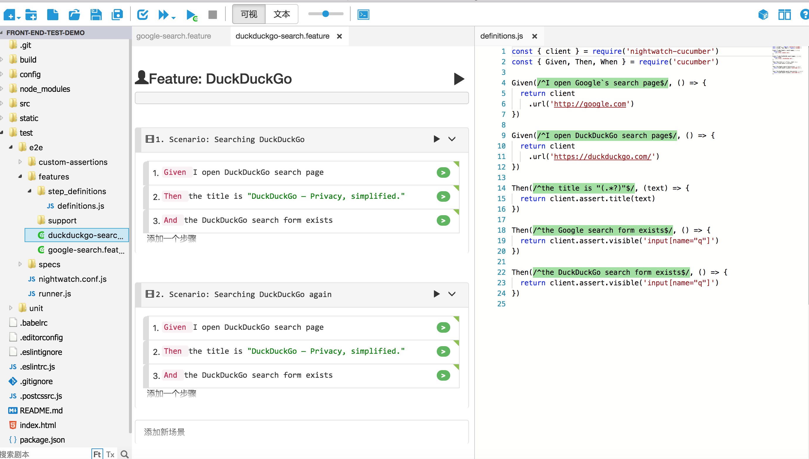

＃ Vue BDD 实作

<p style="color:#fff;background:#f00;padding-left:20px;">以下范例需要科学上网才能正常运行</p>

采用 `Nightwatch` + `Cucumber` ，可安装 cuketest 工具提升效率。

### BDD 维度
实现各业务功能的主要行为流

### 档案结构
``` 
└── test
    └── e2e
        ├── custom-assertions         // 自定义断言
        │   └── elementCount.js
        ├── features                  // Cucumber Gherkin 文件（Cucumber）
        │   ├── step_definitions      // 步骤定义脚本文件夹
        │   │   └── definitions.js     
        │   ├── support               // 抽象出来的脚本
        │   │   └── support.js 
        │   ├── function1.feature     // 剧本文件
        │   └── function2.feature     // 剧本文件  
        ├── page-objects              // 页面对象文件夹 （Nightwatch）
        ├── reports                   // 输出报表文件夹
        ├── screenshots               // 自动截屏
        ├── nightwatch.conf.js        // Nightwatch 运行配置
        ├── runner.js                 // 运行器
        └── specs                     // Nightwatch 测试文件 （Nightwatch）(使用 cucumber 后就用不到)
            └── test.spec.js
```

#### Step1: 安装 Cucumber 插件
> npm i nightwatch-cucumber cucumber geckodriver cucumber-pretty nightwatch-helpers phantomjs-prebuilt -D
> // or
> yarn add nightwatch-cucumber cucumber geckodriver cucumber-pretty nightwatch-helpers phantomjs-prebuilt -D

#### Step2: nightwatch.conf.js 配置
```js
require('babel-register')
require('nightwatch-cucumber')({  // cucumber 参数
  cucumberArgs: [
      '--require',
      'test/e2e/features/step_definitions',
      '--format',
      'node_modules/cucumber-pretty',
      '--format',
      'json:test/e2e/reports/cucumber.json',
      'test/e2e/features'
  ]
})
// const seleniumServer = require('selenium-server')
const chromedriver = require('chromedriver')  // chrome
const geckodriver = require('geckodriver')  // firefox
const phantomjs = require('phantomjs-prebuilt');
 
const config = require('../../config')  // http://nightwatchjs.org/gettingstarted#settings-file
 
module.exports = {
  // == 基本配置 == //
  src_folders: ['test/e2e/features/step_definitions'],  // BDD 測試文件位置
  output_folder: 'test/e2e/reports',  // report 放置位置
  // custom_assertions_path: ['test/e2e/custom-assertions'],  // 自制断言位置
 
  // 加入 龙雨溪的扩展 API
  custom_commands_path: ['./node_modules/nightwatch-helpers/commands'],
  custom_assertions_path: ['./node_modules/nightwatch-helpers/assertions'],
 
  // == Selenium 配置 ==  //
  selenium: {  // selenium 服务器配置
    start_process: true,  // 配置是否自动管理 selenium 进程
    server_path: seleniumServer.path,  // 运行文件目录
    host: '127.0.0.1',
    port: 4444,
    cli_args: {
      'webdriver.chrome.driver': chromedriver.path
    }
  },
 
  // == 测试环境配置 == //
  test_settings: {  // 测试配置
    default: {
      selenium_port: 4444,
      selenium_host: 'localhost',
      silent: true,
      globals: {
          devServerURL: 'http://localhost:' + (process.env.PORT || config.dev.port)
      },
      desiredCapabilities: {
          browserName: 'chrome',
          javascriptEnabled: true,
          acceptSslCerts: true,
          chromeOptions: {
              args: ['incognito', 'headless', 'no-sandbox', 'disable-gpu']
          }
      },
      selenium: {
          cli_args: {
              'webdriver.chrome.driver': chromedriver.path
          }
      }
    },
    chrome: {
      desiredCapabilities: {
          browserName: 'chrome',
          javascriptEnabled: true,
          acceptSslCerts: true
      },
      selenium: {
          cli_args: {
              'webdriver.chrome.driver': chromedriver.path
          }
      }
    },
    firefox: {
      desiredCapabilities: {
          browserName: 'firefox',
          javascriptEnabled: true,
          acceptSslCerts: true
      },
      selenium: {
      cli_args: {
          'webdriver.gecko.driver': geckodriver.path
          }
      }
    },
    phantom: {
      desiredCapabilities: {
        browserName: 'phantomjs',
        javascriptEnabled: true,
        acceptSslCerts: true,
        'phantomjs.page.settings.userAgent': 'Mozilla/5.0 (Macintosh; Intel MacOS X 10_10_5) AppleWebKit/537.36 (KHTML, like Gecko) Chrome/46.0.2490.80 Safari/537.36',
        'phantomjs.binary.path': phantomjs.path
      }
    }
  }
}
```

#### Step3: 建立 feature 架构
```
└── test
    └── e2e
        ├── features // 运行默认从 features 目录遍历文件
        │   ├── step_definitions // 定义自动化脚本
        │   │       └── definitions.js
        │   ├── support // 定义环境支持目录（比如定义运行超时、浏览器驱动）
        │   │       └──
        │   │
        │   ├── google-search.feature
        │   └── duckduckgo-search.feature
```

#### Step4: 在 features/ 下建立 .feature 档
➔ test/e2e/features/duckduckgo-search.feature
```js
Feature: DuckDuckGo
  Scenario: Searching DuckDuckGo
    Given I open DuckDuckGo search page
    Then the title is "DuckDuckGo — Privacy, simplified."
    And the DuckDuckGo search form exists
  Scenario: Searching DuckDuckGo again
    Given I open DuckDuckGo search page
    Then the title is "DuckDuckGo — Privacy, simplified."
    And the DuckDuckGo search form exists
```

➔ test/e2e/features/google-search.feature
```
Feature: Google Search
  Scenario: Searching Google
    Given I open Google`s search page
    Then the title is "Google"
    And the Google search form exists
  Scenario: Searching Google again
    Given I open Google`s search page
    Then the title is "Google"
    And the Google search form exists
```

#### Step5: 在features/step_definitions/ 下建立 definitions.js
➔ test/e2e/features/step_definitions/definitions.js
```js
const { client } = require('nightwatch-cucumber')
const { Given, Then, When } = require('cucumber')
 
 
Given(/^I open Google`s search page$/, () => {
  return client
    .url('http://google.com')
})
 
Given(/^I open DuckDuckGo search page$/, () => {
  return client
    .url('https://duckduckgo.com/')
})
 
Then(/^the title is "(.*?)"$/, (text) => {
  return client.assert.title(text)
})
 
Then(/^the Google search form exists$/, () => {
  return client.assert.visible('input[name="q"]')
})
 
Then(/^the DuckDuckGo search form exists$/, () => {
  return client.assert.visible('input[name="q"]')
})
```

#### Step6: 用 cuketest 工具打开项目，如下图，可以修改 .feature 语法及测试正确性。详细使用请参考 cuketest 


#### Step7: 执行 `npm run e2e`

