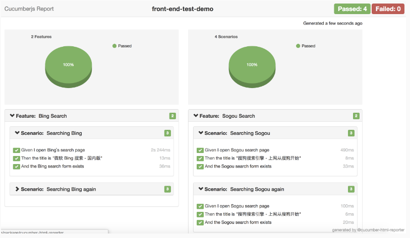

# BDD report

前面,我们介绍了 BDD 测试，BDD 的报表产出，格式为 JSON + XML ，为让更好阅读，藉由插件产出较好阅读的 HTML 格式。

✓ Step1 安装 report 插件 [cucumber-html-reporter](https://www.npmjs.com/package/cucumber-html-reporter)


✓ Step2 在根目录下建立 cucumble-html-reports.js，内容下

```js
const reporter = require('cucumber-html-reporter');
var options = {
	theme: 'bootstrap',
	jsonFile: 'test/e2e/reports/cucumber.json',
	output: 'test/e2e/reports/cucumber_report.html',
	reportSuiteAsScenarios: true,
	launchReport: true,
};
reporter.generate(options);
```

✓ Step3 修改 package.json

```json
"scripts": {
	"e2e": "node test/e2e/runner.js && node ./cucumble-html-reports.js",
},

```

✓ Step4 产出报表

```
npm run e2e
```
