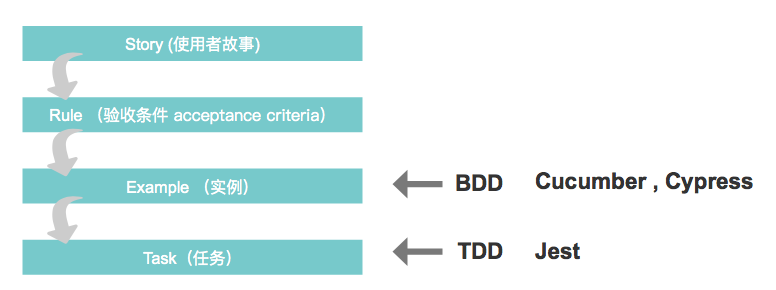
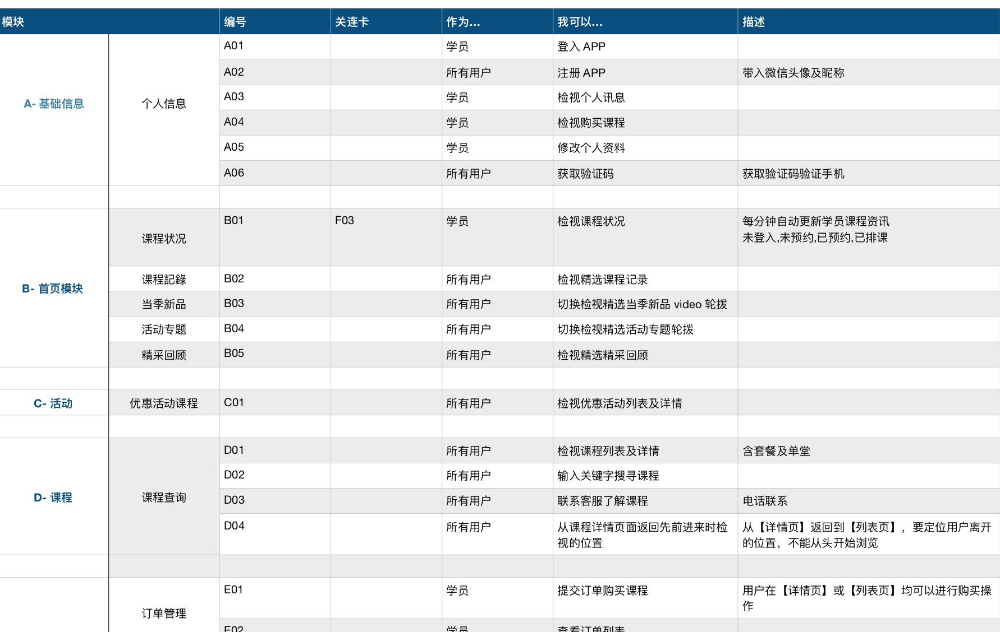
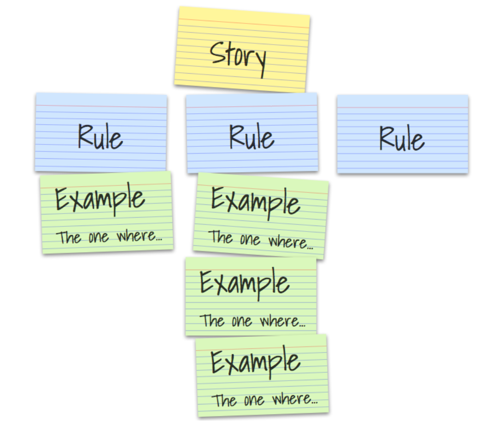

# 设计可测试的文件

- 将需求拆成使用者故事维度

- 用户故事转译成一系列的特征（Features）
- 为了对应 Example Mapping，加入了 Rule (as of Gherkin 6) 关键字
- 实例映射和事件风暴（Event Storming）对于发现实例来说，都是很好的协同分析技术。

|Gherkin|Example Mapping|
|:---|:---|
|Feature|Story|
|Rule|Rule|
|Scenario|Example|

## Example Mapping
### 怎么工作的
我们可以通过索引卡片的方式，获取这些不同种类的信息，通过导图可以组织它们，了解彼此的关系：
- 我们在黄色卡片上写下故事，然后把它放在顶部
- 每一个验收标准或规则写在蓝色卡片上，然后放在黄色故事卡片下面
- 说明这些规则的实例写在绿色卡片上，然后根据相关规则置放
- 会话中不能回答的问题就写在红色卡片上，这样我们的会话可以（暂时不用关注这些问- 题）继续进行

实例建模（Modeling By Example）
